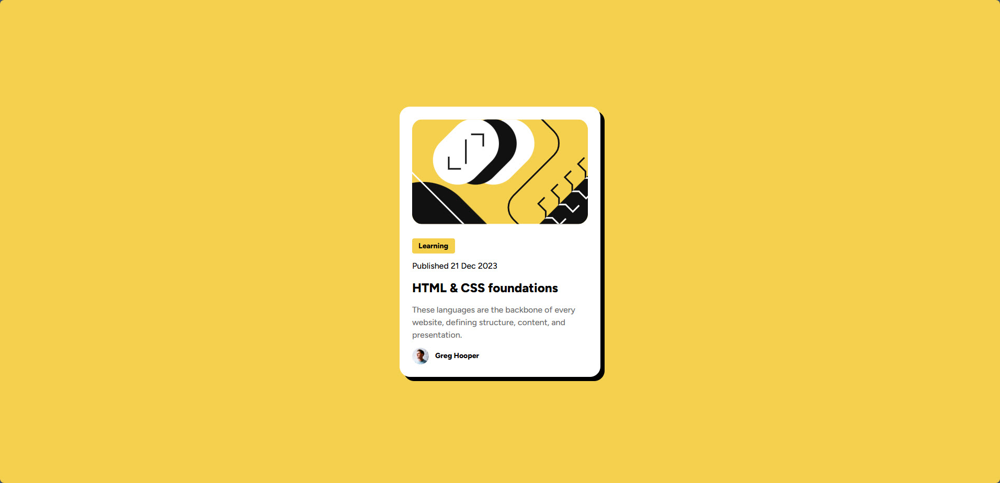

# Frontend Mentor - Blog Preview Card Solution



## Project Links & Badges

<div style="text-align:left;">

[](https://01-newbie-blog-preview-card.netlify.app/)  
[](https://github.com/arwinux/frontend-journey/tree/main/01-newbie/blog-preview-card)  
[](https://www.frontendmentor.io/solutions/blog-preview-card-solution-s8_wDg1zTY)  
[](https://opensource.org/licenses/MIT)  
[](https://github.com/arwinux)  
[](https://www.netlify.com)  
[](#)

</div>

This is a solution to the [Blog preview card challenge on Frontend Mentor](https://www.frontendmentor.io/challenges/blog-preview-card-ckPaj01IcS). Frontend Mentor challenges help you improve your coding skills by building realistic projects.

## Table of contents

- [Frontend Mentor - Blog Preview Card Solution](#frontend-mentor---blog-preview-card-solution)
  - [Project Links \& Badges](#project-links--badges)
  - [Table of contents](#table-of-contents)
  - [Overview](#overview)
    - [The challenge](#the-challenge)
    - [Links](#links)
  - [My process](#my-process)
    - [Built with](#built-with)
    - [Project Structure](#project-structure)
    - [What I learned](#what-i-learned)
    - [Continued development](#continued-development)
    - [Useful resources](#useful-resources)
  - [Author](#author)
  - [Acknowledgments](#acknowledgments)

## Overview

### The challenge

Users should be able to:

- View the blog preview card component in a centered, responsive layout
- See hover states for interactive elements with smooth transitions
- Experience a clean, accessible design that works across devices
- Interact with the card to see enhanced shadow and color effects

### Links

- Solution URL: [GitHub Repository](https://github.com/arwinux/frontend-journey/tree/main/01-newbie/blog-preview-card)
- Live Site URL: [Live Demo](https://01-newbie-blog-preview-card.netlify.app/)

## My process

### Built with

- **Semantic HTML5 markup** - Used proper semantic elements like `<main>`, `<article>`, and `<h1>`
- **CSS custom properties** - Implemented CSS variables for consistent theming
- **BEM methodology** - Block Element Modifier methodology for scalable CSS
- **Flexbox** - Used for centering and layout structure
- **Mobile-first workflow** - Designed with responsive principles in mind
- **Modern CSS architecture** - Organized stylesheets with imports and modular structure
- **Custom fonts** - Integrated Figtree font family with proper font-face declarations
- **CSS transitions** - Smooth hover effects and interactive states

### Project Structure

```
blog-preview-card/
├── design/                    # Design reference files
│   ├── active-states.jpg
│   ├── desktop-design.jpg
│   └── mobile-design.jpg
├── assets/                    # All project assets
│   ├── fonts/
│   │   ├── static/
│   │   │   ├── Figtree-ExtraBold.ttf
│   │   │   └── Figtree-Medium.ttf
│   │   └── Figtree-VariableFont_wght.ttf
│   └── images/                # Images and icons
│       ├── favicon-32x32.png
│       ├── illustration-article.svg
│       └── image-avatar.webp
├── src/                       # Source code
│   └── css/                   # CSS architecture
│       ├── main.css           # Main component styles
│       ├── reset.css          # CSS reset
│       ├── typography.css     # Text styling presets
│       └── variable.css       # Design tokens & fonts
├── .gitignore
├── index.html                 # Main HTML file
├── preview.jpg                # Project preview
├── README.md
├── DEVELOPMENT.md             # Development notes
└── style-guide.md             # Design system guide
```

### What I learned

This project reinforced several important concepts:

**CSS Architecture**: I implemented a modular CSS structure separating concerns into different files:

- `reset.css` for normalizing browser defaults
- `variable.css` for design tokens and font declarations
- `typography.css` for text styling presets
- `main.css` for component-specific styles

The project also includes design reference files in the `design/` folder and follows Frontend Mentor's recommended structure with organized assets and clear separation of concerns.

**CSS Custom Properties**: Used CSS variables for maintainable design tokens:

```css
:root {
  --color-white: hsl(0, 0%, 100%);
  --color-yellow: #f4d04e;
  --color-gray-950: #111111;
  --color-gray-500: #6b6b6b;

  --spacing-50: 0.4rem;
  --spacing-150: 1.2rem;
  --spacing-300: 2.4rem;
}
```

**Typography System**: Created reusable text presets for consistent styling:

```css
.text-preset-1 {
  font-size: 2.4rem;
  line-height: 150%;
  font-family: var(--font-extrabold);
  transition: all 400ms linear;
}
```

**Interactive States**: Implemented smooth hover effects with CSS transitions:

```css
.blog-card {
  box-shadow: 0.8rem 0.8rem 0rem black;
  transition: all 400ms linear;
}

.blog-card:hover {
  box-shadow: 1.5rem 1.5rem 0rem black;
}

.blog-card:hover .text-preset-1 {
  color: var(--color-yellow);
}
```

**Flexbox Centering**: Implemented perfect centering using modern CSS:

```css
main {
  display: flex;
  flex-direction: column;
  justify-content: center;
  align-items: center;
  min-height: 100vh;
}
```

### Continued development

Areas I want to focus on in future projects:

- **CSS Grid** - Explore more complex layouts using CSS Grid
- **Advanced animations** - Add subtle micro-interactions and keyframe animations
- **Accessibility improvements** - Implement better focus states and ARIA labels
- **Performance optimization** - Optimize font loading and implement critical CSS
- **CSS Container queries** - Use for more responsive component-based design
- **Dark mode support** - Implement theme switching functionality

### Useful resources

- [CSS Custom Properties Guide](https://developer.mozilla.org/en-US/docs/Web/CSS/Using_CSS_custom_properties) - Helped me understand CSS variables implementation
- [Flexbox Complete Guide](https://css-tricks.com/snippets/css/a-guide-to-flexbox/) - Excellent resource for flexbox layouts
- [CSS Transitions](https://developer.mozilla.org/en-US/docs/Web/CSS/CSS_Transitions) - Great documentation for implementing smooth hover effects
- [Modern CSS Reset](https://piccalil.li/blog/a-modern-css-reset/) - Inspiration for the reset.css approach

## Author

- Frontend Mentor - [@arwinux](https://www.frontendmentor.io/profile/arwinux)
- GitHub - [@arwinux](https://github.com/arwinux)

## Acknowledgments

Thanks to Frontend Mentor for providing this challenge and to the community for feedback and inspiration. The structured approach to CSS architecture was influenced by modern CSS methodologies and best practices from the web development community. The interactive hover effects were inspired by modern UI design principles and accessibility guidelines.
