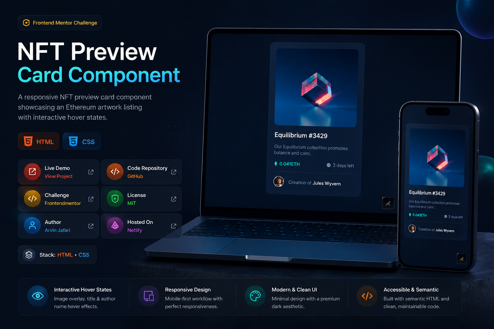

# NFT Preview Card Component



---

## Project Links & Badges

[](https://arwinux.github.io/frontend-journey/01-newbie/nft-preview-card-component)  
[](https://github.com/arwinux/frontend-journey/tree/main/01-newbie/nft-preview-card-component)  
[]()  
[](https://opensource.org/licenses/MIT)  
[](https://github.com/arwinux)  
[](https://www.netlify.com)  
[](#)

---

## Overview

A responsive NFT preview card component showcasing an Ethereum artwork listing. Displays the NFT image, title, collection description, price, countdown, and creator details with interactive hover states.

### The challenge

- View a card layout that matches the design on mobile and desktop screens
- See hover states on the NFT image, title, and creator name
- Display the NFT image with a cyan overlay and view icon on hover
- Show the Ethereum price, countdown clock, and creator information
- Interact with an expandable author signature badge in the corner

### Links

- **Solution URL:** [GitHub Repository](https://github.com/arwinux/frontend-journey/tree/main/01-newbie/nft-preview-card-component)
- **Live Site URL:** [Live demo](https://arwinux.github.io/frontend-journey/01-newbie/nft-preview-card-component)

---

## My process

### Built with

- Semantic HTML5
- CSS Custom Properties
- Flexbox
- CSS Grid
- Mobile-first workflow
- BEM naming convention
- Self-hosted Outfit font (woff/woff2)
- Vanilla JavaScript (author signature badge toggle)

### Project Structure

```
nft-preview-card-component/
├── assets/
│   ├── fonts/
│   │   └── Outfit/
│   └── images/
├── design/
├── src/
│   ├── css/
│   │   ├── component.css
│   │   ├── main.css
│   │   ├── reset.css
│   │   ├── typography.css
│   │   └── variable.css
│   └── js/
│       └── arwinux-badge.js
├── index.html
├── preview.jpg
├── README.md
└── style-guide.md
```

### Continued development

- Improve focus states and keyboard navigation for accessibility
- Add a working link to the NFT marketplace page
- Enhance animations with reduced-motion support for the signature badge
- Extend hover states with subtle background transitions
- Optimize image loading with responsive srcset and lazy loading
- Refactor the signature badge JavaScript into a reusable module

### Useful resources

- [MDN: CSS Custom Properties](https://developer.mozilla.org/en-US/docs/Web/CSS/Using_CSS_custom_properties) - Reference for managing the color palette and design tokens.
- [CSS-Tricks: A Complete Guide to Flexbox](https://css-tricks.com/snippets/css/a-guide-to-flexbox/) - Used for centering and aligning the card content.
- [MDN: CSS aspect-ratio](https://developer.mozilla.org/en-US/docs/Web/CSS/aspect-ratio) - Used to maintain the square NFT image proportion.
- [Google Fonts: Outfit](https://fonts.google.com/specimen/Outfit) - The font family used for the card typography.
- [Frontend Mentor](https://www.frontendmentor.io/) - Platform for frontend coding challenges.

---

## Author

- **Frontend Mentor** - [https://www.frontendmentor.io/profile/arwinux](https://www.frontendmentor.io/profile/arwinux)
- **GitHub** - [https://github.com/arwinux](https://github.com/arwinux)
- **LinkedIn** - https://www.linkedin.com/in/arwinux/

---

## Acknowledgments

Thanks to Frontend Mentor for the challenge and to the open-source community for the tools and resources that made this project possible.
