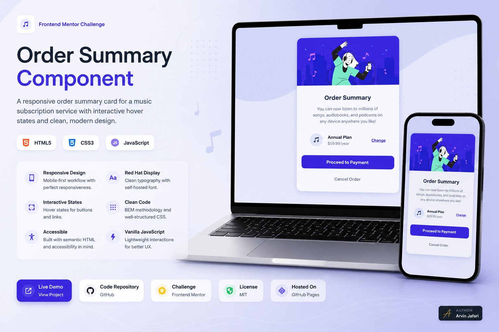

# Order Summary Component



---

## Project Links & Badgest

[](https://arwinux.github.io/frontend-journey/01-newbie/order-summary-component/)  
[](https://github.com/arwinux/frontend-journey/tree/main/01-newbie/order-summary-component)  
[](#)  
[](https://opensource.org/licenses/MIT)  
[](https://github.com/arwinux)  
[](https://www.netlify.com)  
[](#)

---

## Overview

A responsive order summary card for a music subscription service. Displays the plan details, price, and payment actions with hover states on interactive elements.

### The challenge

- View a card layout that matches the design on mobile and desktop screens
- See hover states on the payment and cancel buttons
- Hover over the plan change link to see its active state
- Display the annual plan with price and music icon
- Interact with an expandable author signature badge in the corner

### Links

- **Solution URL:** [GitHub Repository](https://github.com/arwinux/frontend-journey/tree/main/01-junior/order-summary-component)
- **Live Site URL:** [Live demo](https://arwinux.github.io/frontend-journey/01-newbie/order-summary-component/)

---

## My process

### Built with

- Semantic HTML5
- CSS Custom Properties
- Flexbox
- CSS Grid
- Mobile-first workflow
- BEM naming convention
- Self-hosted Red Hat Display font (woff2)
- Vanilla JavaScript (author signature badge toggle)

### Project Structure

```
order-summary-component/
├── assets/
│   ├── fonts/
│   │   └── RedHadt/
│   └── images/
├── design/
├── src/
│   └── css/
│       ├── component.css
│       ├── main.css
│       ├── reset.css
│       ├── typography.css
│       └── variable.css
├── index.html
├── preview.jpg
├── README.md
└── style-guide.md
```

### Continued development

- Improve focus states and keyboard navigation for accessibility
- Add a working link to the plan change and payment actions
- Enhance animations with reduced-motion support for the signature badge
- Optimize the background pattern for different screen sizes
- Refactor the inline signature badge script into a separate module
- Add a confirmation state after payment submission

### Useful resources

- [MDN: CSS Custom Properties](https://developer.mozilla.org/en-US/docs/Web/CSS/Using_CSS_custom_properties) - Reference for managing the color palette and design tokens.
- [CSS-Tricks: A Complete Guide to Flexbox](https://css-tricks.com/snippets/css/a-guide-to-flexbox/) - Used for centering and aligning the card content.
- [MDN: CSS Grid Layout](https://developer.mozilla.org/en-US/docs/Web/CSS/CSS_Grid_Layout) - Used to center the card on the page.
- [Google Fonts: Red Hat Display](https://fonts.google.com/specimen/Red+Hat+Display) - The font family used for the card typography.
- [Frontend Mentor](https://www.frontendmentor.io/) - Platform for frontend coding challenges.

---

## Author

- Frontend Mentor - [https://www.frontendmentor.io/profile/arwinux](https://www.frontendmentor.io/profile/arwinux)
- GitHub - [https://github.com/arwinux](https://github.com/arwinux)
- Linkeing - [https://github.com/arwinux](https://www.linkedin.com/in/arwinux/)

---

## Acknowledgments

Thanks to Frontend Mentor for the challenge and to the open-source community for the tools and resources that made this project possible.
