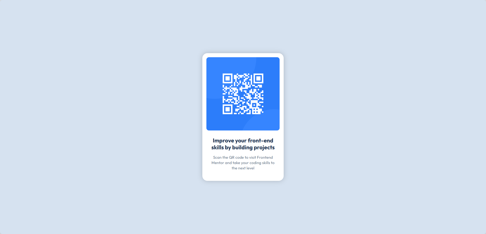

# Frontend Mentor - QR Code Component Solution

This is a solution to the [QR code component challenge on Frontend Mentor](https://www.frontendmentor.io/challenges/qr-code-component-iux_sIO_H). Frontend Mentor challenges help you improve your coding skills by building realistic projects.

## Table of contents

- [Overview](#overview)
  - [Screenshot](#screenshot)
  - [Links](#links)
- [My process](#my-process)
  - [Built with](#built-with)
  - [What I learned](#what-i-learned)
  - [Continued development](#continued-development)
  - [Useful resources](#useful-resources)
- [Author](#author)
- [Acknowledgments](#acknowledgments)

## Overview

### The challenge

Users should be able to:
- View the QR code component in a centered, responsive layout
- See hover states for interactive elements (if applicable)
- Experience a clean, accessible design that works across devices

### Screenshot



### Links

- Solution URL: [GitHub Repository](https://github.com/arwinux/qr-code-component)
- Live Site URL: [Live Demo](https://arwinux.github.io/frontend-journey/01-newbie/qr-code-component)

## My process

### Built with

- **Semantic HTML5 markup** - Used proper semantic elements like `<main>`, `<article>`, and `<figure>`
- **CSS custom properties** - Implemented CSS variables for consistent theming
- **BEM** - Block Element Modifier methodology methodology 
- **Flexbox** - Used for centering and layout structure
- **Mobile-first workflow** - Designed with responsive principles in mind
- **Modern CSS architecture** - Organized stylesheets with imports and modular structure
- **Custom fonts** - Integrated Outfit font family with proper font-face declarations

### Project Structure

```
QR code component/
├── design/                    # Design reference files
│   ├── desktop-design.jpg
│   └── mobile-design.jpg
├── src/                       # Source code
│   ├── assets/                # All project assets
│   │   ├── fonts/
│   │   │   ├── Outfit-Bold.ttf
│   │   │   └── Outfit-Regular.ttf
│   │   └── images/            # Images and icons
│   │       ├── favicon-32x32.png
│   │       └── image-qr-code.png
│   ├── scripts/               # JavaScript files (if needed)
│   └── styles/                # CSS architecture
│       ├── main.css           # Main component styles
│       ├── reset.css          # CSS reset
│       ├── typography.css     # Text styling presets
│       └── variables.css      # Design tokens & fonts
├── .gitignore
├── index.html                 # Main HTML file
├── preview.png                # Project preview
├── README.md
├── DEVELOPMENT.md             # Development notes
└── style-guide.md             # Design system guide
```

### What I learned

This project reinforced several important concepts:

**CSS Architecture**: I implemented a modular CSS structure separating concerns into different files:
- `reset.css` for normalizing browser defaults
- `variables.css` for design tokens and font declarations
- `typography.css` for text styling presets
- `main.css` for component-specific styles

The project also includes design reference files in the `design/` folder and follows Frontend Mentor's recommended structure with organized assets and clear separation of concerns.

**CSS Custom Properties**: Used CSS variables for maintainable design tokens:

```css
:root {
  --white: hsl(0, 0%, 100%);
  --color-blue-300: hsl(212, 45%, 89%);
  --color-blue-500: hsl(216, 15%, 48%);
  --color-blue-900: hsl(218, 44%, 22%);
  
  --spacing-500: 40px;
  --spacing-300: 24px;
  --spacing-200: 16px;
}
```

**Typography System**: Created reusable text presets for consistent styling:

```css
.text-preset-1 {
  font-size: 2.2rem;
  line-height: 120%;
  font-family: "outfit-bold";
  color: var(--color-blue-900);
}
```

**Flexbox Centering**: Implemented perfect centering using modern CSS:

```css
main {
  display: flex;
  align-items: center;
  justify-content: center;
  min-height: 100vh;
}
```

### Continued development

Areas I want to focus on in future projects:

- **CSS Grid** - Explore more complex layouts using CSS Grid
- **Advanced animations** - Add subtle hover effects and transitions
- **Accessibility improvements** - Implement better focus states and ARIA labels
- **Performance optimization** - Optimize font loading and implement critical CSS
- **CSS Container queries** - Use for more responsive component-based design

### Useful resources

- [CSS Custom Properties Guide](https://developer.mozilla.org/en-US/docs/Web/CSS/Using_CSS_custom_properties) - Helped me understand CSS variables implementation
- [Flexbox Complete Guide](https://css-tricks.com/snippets/css/a-guide-to-flexbox/) - Excellent resource for flexbox layouts
- [Modern CSS Reset](https://piccalil.li/blog/a-modern-css-reset/) - Inspiration for the reset.css approach

## Author

- Frontend Mentor - [@arwinux](https://www.frontendmentor.io/profile/arwinux)
- GitHub - [@arwinux](https://github.com/arwinux)

## Acknowledgments

Thanks to Frontend Mentor for providing this challenge and to the community for feedback and inspiration. The structured approach to CSS architecture was influenced by modern CSS methodologies and best practices from the web development community.