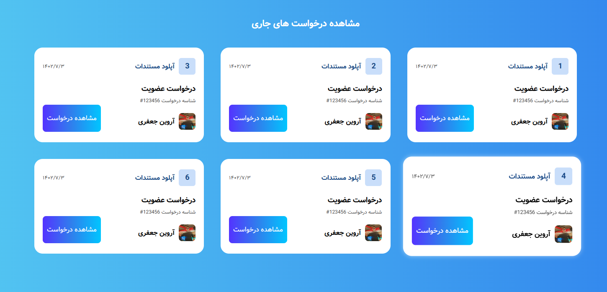

# Request Card Dashboard



## Project Links & Badges

<div style="text-align:left;">

[](https://01-newbie-request-card-dashboard.netlify.app/)  
[](https://github.com/arwinux/frontend-journey/tree/main/01-newbie/request-card-dashboard)  
[](#)  
[](https://opensource.org/licenses/MIT)  
[](https://github.com/arwinux)  
[](https://www.netlify.com)  
[](#)

</div>

## 📋 Description

A sleek and modern dashboard for managing and displaying request cards in a Persian (Farsi) RTL interface. This project was created as part of the Fronthooks Academy Bootcamp. The dashboard features an elegant gradient background with floating glass-morphic request cards displaying membership requests in various stages.

## ✨ Features

- **RTL Support**: Fully supports right-to-left text direction for Persian/Farsi language
- **Responsive Design**: Adapts smoothly to different screen sizes
- **Glass-morphism Effect**: Modern UI with frosted glass card design
- **Animation Effects**: Smooth animations using AOS (Animate On Scroll) library
- **Hover Effects**: Interactive card scaling and shadow effects on hover
- **Step Indicators**: Visual indicators showing the progress of each request

## 🚀 Technologies Used

- HTML5
- CSS3
  - Custom CSS Variables
  - Flexbox Layout
  - CSS Transitions
  - Media Queries
- JavaScript
- [AOS](https://michalsnik.github.io/aos/) - Animate On Scroll library

## 🖼️ Preview

The dashboard displays multiple request cards that show:

- Current step in the process (numbered 1-6)
- Request date (in Persian calendar format)
- Request type and ID
- User information with avatar
- Action button

## 💻 Installation and Setup

1. Clone the repository:

   ```bash
   git clone https://github.com/arwinux/bootcamp-task-1.git
   ```

2. Navigate to the project directory:

   ```bash
   cd bootcamp-task-1
   ```

3. Open `index.html` in your browser or use a live server extension.

## 📁 Project Structure

```
request-card-dashboard/
│
├── index.html           # Main HTML file
├── css/
│   ├── style.css        # Main stylesheet
│   └── fonts.css        # Font imports
├── assets/
│   └── images/
│       └── avatar.jpg   # User avatar image
└── README.md            # Project documentation
```

## 🔍 Future Improvements

- Add functionality to the "View Request" buttons
- Implement a carousel for mobile view
- Add filter functionality for request types
- Create a dark mode theme option
- Implement a backend to fetch real request data

## 🤝 Contributing

Contributions, issues, and feature requests are welcome! Feel free to check the [issues page](https://github.com/arwinux/request-card-dashboard/issues).

## 📝 License

This project is [MIT](https://choosealicense.com/licenses/mit/) licensed.

## 👨‍💻 Author

- GitHub: [@arwinux](https://github.com/arwinux)
- Telegram: [@arwinux](https://t.me/arwinuxrepo)

## 🙏 Acknowledgements

- [Fronthooks Academy](https://fronthooks.ir) for the bootcamp opportunity
- [AOS library](https://michalsnik.github.io/aos/) for smooth animations
