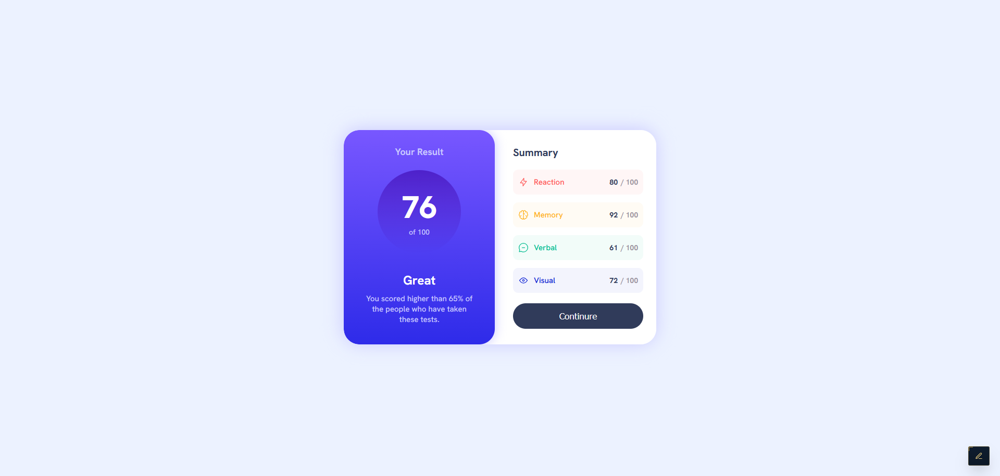

# Results Summary Component



## Project Links & Badgest

[](https://01-newbie-results-summary-component.netlify.app/)  
[](https://github.com/arwinux/frontend-journey/tree/main/01-newbie/results-summary-component)  
[](https://www.frontendmentor.io/challenges/results-summary-component-CE_K6s0maV)  
[](https://opensource.org/licenses/MIT)  
[](https://github.com/arwinux)  
[](https://www.netlify.com)  
[](#)

## Overview

A responsive results summary card that displays a user's test score across four categories (Reaction, Memory, Verbal, Visual) with a gradient result panel and summary list.

## Features

- Results card with circular score display and gradient background
- Summary section with category breakdown and individual scores
- Color-coded category items (red, orange, green, blue)
- Responsive layout: stacked on mobile, side-by-side on desktop
- SVG icon sprite for category icons
- Hover and focus states on the continue button
- Author signature badge with expand-on-hover reveal

## Links

- [Repository](https://github.com/arwinux/frontend-journey)
- [Frontend Mentor Challenge](https://www.frontendmentor.io/challenges/results-summary-component-CE_K6s0maV)

## Tech Stack

- HTML5
- CSS3

## Project Structure

```
results-summary-component/
├── assets/
│   ├── fonts/
│   │   ├── static/
│   │   └── HankenGrotesk-VariableFont_wght.ttf
│   └── images/
│       ├── favicon-32x32.png
│       ├── icons-sprite.svg
│       └── icons-sprite.html
├── design/
├── src/
│   └── css/
│       ├── component.css
│       ├── main.css
│       ├── media.css
│       ├── reset.css
│       ├── typography.css
│       └── variables.css
├── data.json
├── index.html
├── preview.jpg
├── style-guide.md
└── README.md
```

## Installation

```bash
git clone https://github.com/arwinux/frontend-journey.git

cd 01-newbie/results-summary-component
```

Open `index.html` in your browser.

## Future Improvements

- Dynamically populate scores from `data.json` using JavaScript
- Add dark mode support
- Improve keyboard navigation and ARIA labels
- Animate score counter on page load
- Add unit tests for responsiveness
- Replace hardcoded summary items with a reusable component pattern

## Useful Resources

- [MDN Web Docs](https://developer.mozilla.org/) — HTML and CSS reference
- [CSS-Tricks](https://css-tricks.com/) — Flexbox and layout patterns
- [Frontend Mentor](https://www.frontendmentor.io) — Challenge-based learning platform
- [Google Fonts](https://fonts.google.com/specimen/Hanken+Grotesk) — Hanken Grotesk font family

## Author

- GitHub — [arwinux](https://github.com/arwinux)
- LinkedIn — [arwinux](https://linkedin.com/in/arwinux)
- Frontend Mentor — [@arwinux](https://www.frontendmentor.io/profile/arwinux)

## License

MIT License
