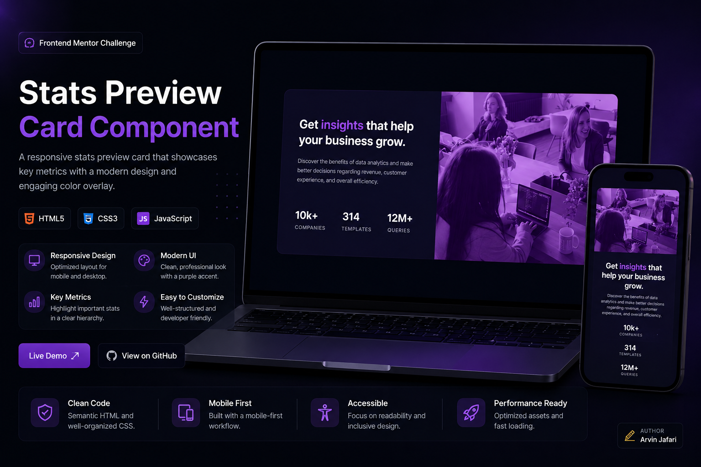

# Stats Preview Card Component



---

## Project Links & Badgest

[](https://arwinux.github.io/frontend-journey/01-newbie/stats-preview-card-component/)  
[](https://github.com/arwinux/frontend-journey/tree/main/01-newbie/stats-preview-card-component)  
[](#)  
[](https://opensource.org/licenses/MIT)  
[](https://github.com/arwinux)  
[](#)  
[](#)

---

## Overview

A responsive stats preview card component built as a Frontend Mentor challenge. The card presents business data insights with a hero image and three stat rows. Built with pure HTML and CSS, plus a small script for the author badge.

---

### The challenge

- Display a stats preview card that adapts between mobile and desktop layouts.
- Present a headline, supporting description, and three key statistics.
- Show an accent-tinted hero image in a two-column desktop layout.
- Reflow the card into a single stacked column on mobile.
- Reveal the author badge on hover (desktop) or tap (touch devices).
- Keep interactive elements keyboard accessible.

---

### Links

- **Solution URL:** [GitHub Repository](https://github.com/arwinux/frontend-journey/tree/main/01-newbie/stats-preview-card-component)
- **Live Site URL:** [Live demo](https://arwinux.github.io/frontend-journey/01-newbie/stats-preview-card-component/)

---

## My process

### Built with

- Semantic HTML5
- CSS Custom Properties
- Flexbox
- CSS Grid
- Responsive Design
- BEM naming convention
- Custom `@font-face` fonts
- JavaScript

---

### Project Structure

```
stats-preview-card-component/
├── assets/
│   ├── fonts/
│   │   ├── Inter/
│   │   └── LexendDeca/
│   └── images/
├── design/
├── src/
│   └── css/
│       ├── component.css
│       ├── layout.css
│       ├── main.css
│       ├── reset.css
│       ├── typography.css
│       └── variable.css
├── index.html
├── preview.jpg
└── README.md
```

---

### Continued development

- Improve accessibility and keyboard focus states.
- Add a reduced-motion preference for transitions and animations.
- Optimize images with responsive `srcset` and `sizes`.
- Refactor duplicate styles into shared utility classes.
- Add a dark/light theme toggle using CSS Custom Properties.
- Improve color contrast to exceed WCAG AA requirements.

---

### Useful resources

- [MDN: CSS Grid Layout](https://developer.mozilla.org/en-US/docs/Web/CSS/CSS_Grid_Layout) - The definitive reference for `display: grid` and its properties.
- [CSS-Tricks: A Complete Guide to Flexbox](https://css-tricks.com/snippets/css/a-guide-to-flexbox/) - A visual, easy-to-follow flexbox cheatsheet.
- [MDN: Using CSS custom properties](https://developer.mozilla.org/en-US/docs/Web/CSS/Using_CSS_custom_properties) - Learn how to define and reuse design tokens with variables.
- [MDN: Using media queries](https://developer.mozilla.org/en-US/docs/Web/CSS/Media_Queries/Using_media_queries) - Build responsive layouts with breakpoints and interaction queries.
- [Frontend Mentor](https://www.frontendmentor.io) - Realistic design challenges with a supportive community.

---

## Author

- Frontend Mentor - [https://www.frontendmentor.io/profile/arwinux](https://www.frontendmentor.io/profile/arwinux)
- GitHub - [https://github.com/arwinux](https://github.com/arwinux)
- Linkeing - [https://github.com/arwinux](https://www.linkedin.com/in/arwinux/)

---

## Acknowledgments

Thanks to Frontend Mentor for the design and challenge. Gratitude also goes to the open-source community for the tools, documentation, and tutorials that made this project possible.
