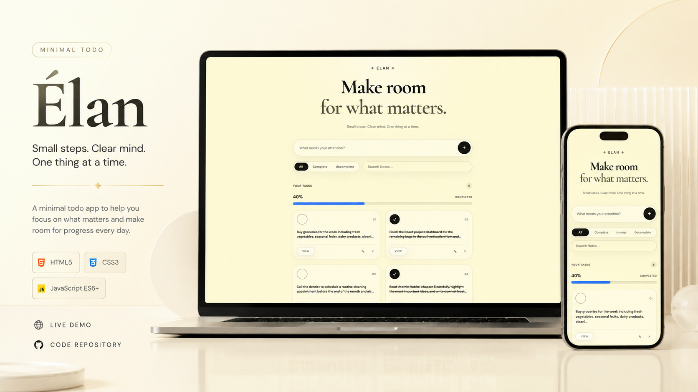

# ✦ Élan — Minimal Todo



---

> _Small steps. Clear mind. One thing at a time._

Élan is a minimal, elegant to-do application built with semantic HTML, modern CSS, and vanilla JavaScript. It focuses on calm, focused task management with a refined editorial aesthetic — letting you make room for what matters.

## Project Links & Badgest

[](https://arwinux.github.io/frontend-journey/02-junior/elan-minimal-todo/)  
[](https://github.com/arwinux/frontend-journey/tree/main/02-junior/elan-minimal-todo)  
[](#)  
[](https://opensource.org/licenses/MIT)  
[](https://github.com/arwinux)  
[](#)  
[](#)

---

## ✨ Features

- ➕ Add tasks quickly with a single input
- ✅ Mark tasks as completed or in progress
- ✏️ Edit existing tasks inline
- 🗑️ Delete tasks you no longer need
- 🔍 Search notes in real time
- 🎛️ Filter between **All**, **Complete**, and **Uncomplete** tasks
- 📊 Live progress bar and completion percentage
- 🔢 Live task counter
- 💾 Persists tasks in `localStorage` across sessions
- 👁️ View task details in a dedicated modal

## 🌐 Links

- **Solution URL:** [GitHub Repository](https://github.com/arwinux/frontend-journey/tree/main/02-junior/elan-minimal-todo)
- **Live Site URL:** [Live demo](https://arwinux.github.io/frontend-journey/02-junior/elan-minimal-todo/)

## 🛠️ Tech Stack

- **HTML5** — Semantic, accessible markup
- **CSS3** — Modular stylesheets (reset, variables, layout, components, typography)
- **JavaScript (ES6+)** — DOM manipulation, filtering, search, and local storage logic

## 📁 Project Structure

```
elan-minimal-todo/
├── index.html              # Main entry point
├── assets/
│   └── fonts/              # Self-hosted Cormorant Garamond & DM Sans fonts
└── src/
    ├── css/
    │   ├── main.css        # Primary stylesheet
    │   ├── reset.css       # CSS normalization
    │   ├── variable.css    # Design tokens & variables
    │   ├── layout.css      # Structural & spacing styles
    │   ├── component.css   # UI components
    │   └── typography.css  # Text styling presets
    └── js/
        ├── script.js               # Main application logic
        └── programmer-badge.js     # Author badge behavior
```

## 🚀 Getting Started

Élan is a static, dependency-free project. Simply open it in your browser:

1. Clone the repository:
   ```bash
   git clone https://github.com/arwinux/frontend-journey.git
   ```
2. Navigate to the project folder:
   ```bash
   cd frontend-journey/02-junior/elan-minimal-todo
   ```
3. Open `index.html` in your browser — no build step or install required.

## 🔑 How It Works

- Tasks are stored in the browser's `localStorage` under the `todos` key.
- The **Add** button appends a new task; empty input is ignored.
- The **search** field filters tasks live as you type.
- The filters let you view all, completed, or uncompleted tasks.
- The progress bar reflects the percentage of completed tasks and updates its color accordingly.
- The **view/edit** modal lets you inspect or revise any task.

## 🧠 Key Takeaways

- Practiced structuring a real app into maintainable CSS files (reset, tokens, layout, components, typography)
- Reinforced vanilla JavaScript patterns for CRUD, filtering, and search
- Gained experience with `localStorage` persistence and live UI updates
- Focused on a polished, minimal aesthetic using self-hosted fonts and editorial typography

## 📄 License

This project is part of a repository released under the [MIT License](https://opensource.org/licenses/MIT).
