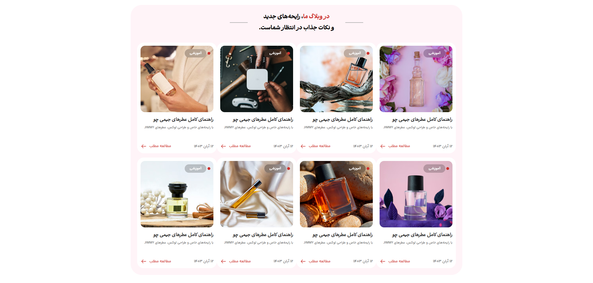

# Jeawaz Blog Post



## Project Links & Badges

<div style="text-align:left;">

[](https://02-junior-jeawaz-blog-post.netlify.app/)  
[](https://github.com/arwinux/frontend-journey/tree/main/02-junior/jeawaz-blog-post)  
[](#)  
[](https://opensource.org/licenses/MIT)  
[](https://github.com/arwinux)  
[](https://www.netlify.com)  
[](#)

</div>

## Overview

A responsive blog post card layout built with HTML and CSS. Displays a grid of Persian-language blog cards with images, category tags, and article metadata.

## Features

- RTL layout for Persian content
- Responsive grid: 1 column on mobile, up to 4 columns on large screens
- Blog card component with image, category badge, and "new" indicator
- Custom Persian fonts (Abar and YekanBakh)
- Glassmorphism effect on category badges
- CSS custom properties for consistent theming
- Hover-ready read more links with arrow icon

### Links

- **Solution URL**: [GitHub Repository](https://github.com/arwinux/frontend-journey/tree/main/02-junior/jeawaz-blog-post)
- **Live Site URL**: [Live Demo](https://02-junior-jeawaz-blog-post.netlify.app/)

## Tech Stack

- HTML5
- CSS3

## Project Structure

```
jeawaz-blog-post/
├── assets/
│   ├── fonts/
│   │   ├── Abar/
│   │   └── YekanBakh/
│   └── images/
├── design/
├── src/
│   └── css/
│       ├── blog.css
│       ├── main.css
│       ├── media.css
│       ├── reset.css
│       ├── typography.css
│       └── variables.css
├── index.html
└── README.md
```

## Installation

```bash
git clone https://github.com/arwinux/frontend-journey.git

cd 02-junior/jeawaz-blog-post
```

Open `index.html` in your browser.

## Future Improvements

- Add individual blog post pages
- Implement search and filtering
- Add dark mode support
- Improve accessibility (ARIA labels, keyboard navigation)
- Add loading states and image lazy loading
- Convert to a dynamic CMS-backed blog

## Useful Resources

- [MDN Web Docs](https://developer.mozilla.org/) — HTML and CSS reference
- [CSS-Tricks](https://css-tricks.com/) — CSS guides and layout patterns
- [Google Fonts](https://fonts.google.com/) — Web font resources
- [RTL Styling](https://rtlstyling.com/) — RTL CSS best practices

## Author

- GitHub — [arwinux](https://github.com/arwinux)
- LinkedIn — [arwinux](https://linkedin.com/in/arwinux)

## License

MIT License
