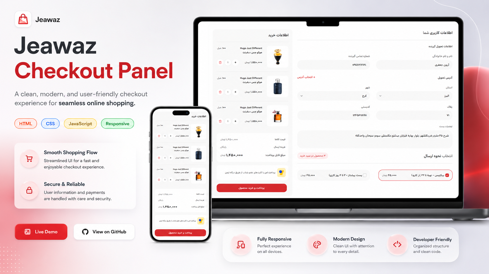

# Jeawaz Checkout Panel



---

## Project Links & Badges

[](https://arwinux.github.io/frontend-journey/02-junior/jeawaz-checkout-panel/)  
[](https://github.com/arwinux/frontend-journey/tree/main/02-junior/jeawaz-checkout-panel)  
[]()  
[](https://opensource.org/licenses/MIT)  
[](https://github.com/arwinux)  
[](https://www.github.com)  
[](#)

---

## Overview

A Persian RTL checkout panel for an e-commerce store. Collects delivery details, displays product cards with quantity controls, and shows an order summary with payment options.

### The challenge

- Fill in delivery recipient information including name and phone number
- Select province and city from dropdown menus
- Enter full address, plaque number, and postal code
- Choose between shipping methods (Tipax or Pishtaz) with pricing
- View product cards with English and Persian names, volume, and price
- Adjust item quantities using increase and delete actions
- Review order summary with subtotal, shipping cost, and total payable amount

### Links

- **Solution URL:** [GitHub Repository](https://github.com/arwinux/frontend-journey/tree/main/02-junior/jeawaz-checkout-panel)
- **Live Site URL:** [Live demo](https://arwinux.github.io/frontend-journey/02-junior/jeawaz-checkout-panel/)

---

## My process

### Built with

- Semantic HTML5
- CSS Custom Properties
- CSS Grid
- Flexbox
- Mobile-first workflow
- RTL layout
- BEM naming convention
- SVG icons

### Project Structure

```
jeawaz-checkout-panel/
├── assets/
│   ├── fonts/
│   │   ├── abar/
│   │   ├── peyda/
│   │   └── yekanbach/
│   └── images/
│       └── products/
├── src/
│   ├── components/
│   │   ├── badge.html
│   │   ├── button.html
│   │   └── form.html
│   └── css/
│       ├── components.css
│       ├── layout.css
│       ├── main.css
│       ├── media.css
│       ├── reset.css
│       ├── typography.css
│       └── variable.css
├── index.html
├── preview.jpg
└── README.md
```

### Continued development

- Add form validation and error state styling for required fields
- Implement quantity update logic with JavaScript
- Add responsive breakpoints for tablet-sized screens
- Improve accessibility with ARIA labels and keyboard navigation
- Refactor CSS to reduce duplication across components
- Add a success or confirmation page after payment submission

### Useful resources

- [MDN: CSS Grid Layout](https://developer.mozilla.org/en-US/docs/Web/CSS/CSS_Grid_Layout) - Reference for the two-column desktop checkout layout.
- [CSS-Tricks: A Complete Guide to Flexbox](https://css-tricks.com/snippets/css/a-guide-to-flexbox/) - Used for card and form alignment patterns.
- [web.dev: Responsive Web Design](https://web.dev/learn/design/) - Principles for mobile-first responsive design.
- [MDN: CSS Custom Properties](https://developer.mozilla.org/en-US/docs/Web/CSS/Using_CSS_custom_properties) - Guide to managing design tokens with CSS variables.
- [Frontend Mentor](https://www.frontendmentor.io/) - Platform for frontend coding challenges.

---

## Author

- **GitHub:** https://github.com/arwinux
- **LinkedIn:** https://www.linkedin.com/in/arwinux/
