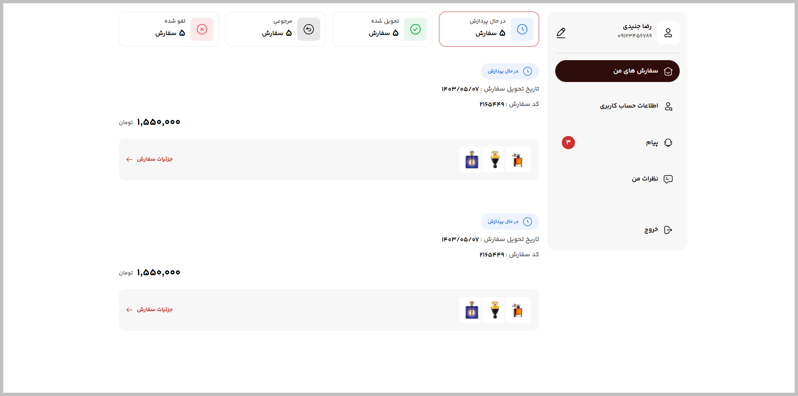

# Jeawaz User Panel



---

## Project Links & Badges

[](https://02-junior-jeawaz-user-panel.netlify.app/)  
[](https://github.com/arwinux/frontend-journey/tree/main/02-junior/jeawaz-user-panel)  
[]()  
[](https://opensource.org/licenses/MIT)  
[](https://github.com/arwinux)  
[](https://www.netlify.com)  
[](#)

---

## Overview

A responsive user dashboard panel for managing orders. Displays order status filters, account information, and order cards with product details in a clean RTL layout.

### The challenge

- View order status categories (processing, delivered, returned, cancelled)
- Filter orders by status using horizontal scroll on mobile and grid on desktop
- See account profile information and navigation menu
- View order details including delivery date, order code, and total price
- See product thumbnails stacked inside each order card
- Navigate between dashboard sections via sidebar menu

### Links

- **Solution URL:** [GitHub Repository](https://github.com/arwinux/frontend-journey/tree/main/02-junior/jeawaz-user-panel)
- **Live Site URL:** [Live demo](https://02-junior-jeawaz-user-panel.netlify.app/)

---

## My process

### Built with

- Semantic HTML5
- CSS Custom Properties
- CSS Grid
- Flexbox
- Mobile-first workflow
- SVG sprite icons
- RTL layout
- BEM naming convention

### Project Structure

```
jeawaz-user-panel/
├── assets/
│   ├── fonts/
│   │   ├── peyda/
│   │   └── yekanbach/
│   └── images/
├── src/
│   └── css/
│       ├── components.css
│       ├── layout.css
│       ├── main.css
│       ├── media.css
│       ├── reset.css
│       ├── typography.css
│       └── variables.css
├── index.html
├── README.md
└── preview.jpg
```

### Continued development

- Improve keyboard navigation and focus management
- Add responsive breakpoint for tablet screen sizes
- Refactor CSS to reduce duplication and improve maintainability
- Enhance the order card layout for smaller mobile screens
- Add order detail modal or expandable card section
- Optimize SVG sprite handling and icon loading

### Useful resources

- [CSS-Tricks: A Complete Guide to Flexbox](https://css-tricks.com/snippets/css/a-guide-to-flexbox/) - Reference for flexbox layout patterns.
- [CSS-Tricks: A Complete Guide to Grid](https://css-tricks.com/snippets/css/complete-guide-grid/) - Reference for CSS grid layout.
- [MDN: CSS Custom Properties](https://developer.mozilla.org/en-US/docs/Web/CSS/Using_CSS_custom_properties) - Guide to using CSS variables.
- [web.dev: Responsive Web Design Basics](https://web.dev/learn/design/) - Fundamentals of responsive design.
- [Frontend Mentor](https://www.frontendmentor.io/) - Platform for frontend coding challenges.

---

## Author

- **GitHub:** https://github.com/arwinux
- **LinkedIn:** https://www.linkedin.com/in/arwinux/

---

## Acknowledgments

Thanks to Frontend Mentor for providing the challenge and to the open-source community for the tools and resources that made this project possible.
