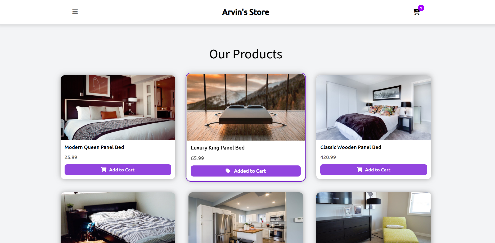
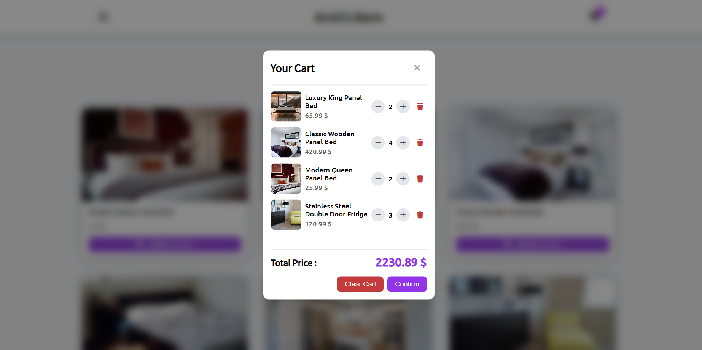

# 🛒 Shopping Cart

<div align="center">

|  |  |
| :-------------------------------: | :-------------------------------: |

_Where shopping meets simplicity in a symphony of design_ ✨

[](https://github.com/arwinux)
[](https://opensource.org/licenses/MIT)
[](https://arwinux.github.io/frontend-journey/02-junior/shopping-cart/)

</div>

## 🎯 Welcome to Shopping Cart

Step into a world where online shopping becomes an art form. Shopping Cart is not just an application—it's a journey through seamless e-commerce, where your products are beautifully presented and your cart is always just a click away.

## ✨ Features

### 🌟 Core Features

- **Elegant Interface**: Browse a clean, modern product grid with smooth transitions
- **Dynamic Cart**: Add, remove, and update product quantities in real time
- **Cart Modal**: View and manage your cart in a beautiful overlay
- **Total Price Calculation**: Instantly see your total as you shop
- **Responsive Design**: Enjoy the app on any device, from mobile to desktop

### 🎨 Visual Elements

- **Modern Design**: Minimalist, user-focused interface
- **Smooth Animations**: Subtle transitions and hover effects
- **Vivid Accents**: Purple highlights and interactive elements
- **Custom Typography**: Carefully selected fonts for readability
- **Responsive Layout**: Flexible grid system adapts to all screens

### 🧩 Project Structure

```
🛒 Shopping Cart/
│
├── 📁 src/                      # Source code organization
│   ├── 📁 styles/               # CSS architecture
│   │   ├── 📄 main.css          # Primary stylesheet
│   │   ├── 📄 reset.css         # CSS normalization
│   │   ├── 📄 typography.css    # Text styling presets
│   │   └── 📄 variables.css     # Design tokens & fonts
│   │
│   ├── 📁 scripts/              # JavaScript modules
│   │   ├── 📄 app.js            # Main application logic
│   │   └── 📄 products.js       # Product data
│   │
│   └── 📁 assets/               # All project assets
│        ├── 📁 fonts/           # Custom fonts
│        └── 📁 images/          # Product images
│
├── 📁 design/                   # UI/UX design previews
│   ├── 🖼️ preview1.png          # Product Grid preview
│   └── 🖼️ preview2.png          # Cart Modal preview
│
├── 📄 index.html                # Main entry point
├── 📄 README.md                 # Project documentation
├── 📄 style-guide.md            # Design system specifications
├── 📄 .gitignore                # Version control exclusions
└── 📄 DEVELOPMENT.md            # Learning notes & challenges
```

## 🚀 Quick Start

### Prerequisites

- A modern web browser
- Basic understanding of HTML, CSS, and JavaScript

### Installation

1. Clone the repository:

```bash
git clone https://github.com/yourusername/shopping-cart.git
```

2. Navigate to the project directory:

```bash
cd shopping-cart
```

3. Open `index.html` in your browser or use a local server:

```bash
# Using Python
python -m http.server

# Using Node.js
npx serve
```

## 💫 Features in Detail

### Cart Management

- **Add to Cart**: Add products with a single click
- **Update Quantity**: Change product quantities directly in the cart
- **Remove Items**: Remove products from your cart
- **Clear Cart**: Empty your cart with one button
- **Confirm Purchase**: Simulate a checkout experience

### Visual Effects

- **Smooth Transitions**: Enjoy seamless UI changes
- **Hover Effects**: Interactive elements respond to your actions
- **Vivid Accents**: Purple highlights for key actions
- **Responsive Design**: Optimized for all screen sizes

## 🛠️ Technical Stack

- **HTML5**: Semantic markup for structure
- **CSS3**: Modern styling with custom properties
- **JavaScript**: Clean, modular code
- **FontAwesome**: Iconography for clarity
- **Responsive Design**: Mobile-first approach

## 🤝 Contributing

We welcome all contributors to help make Shopping Cart better! Whether you're fixing bugs, adding features, or improving documentation, your contributions are valuable.

## 📝 License

This project is licensed under the MIT License - see the [LICENSE](LICENSE) file for details.

## 👨‍💻 Creator

- **Arvin Jafary** - [@Arwinux](https://github.com/arwinux)
  - _Frontend Developer & UI/UX Enthusiast_

## 🙏 Acknowledgments

- Inspired by modern e-commerce experiences
- Built with clean code principles
- Special thanks to the open-source community
- Gratitude to all contributors

---

<div align="center">

_Made with ✨ by [Arvin Jafary](https://github.com/arwinux)_

_May your shopping be as smooth as this cart_ 🛒

</div>
