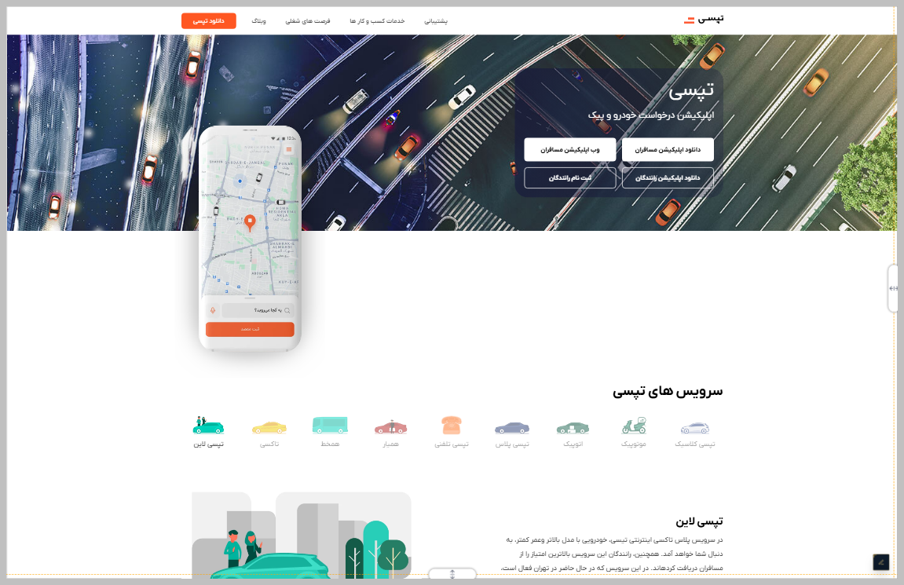

# Tapc Blog



---

## Project Links & Badges

[](https://arwinux.github.io/frontend-journey/02-junior/tapc-blog/)  
[](https://github.com/arwinux/frontend-journey/tree/main/02-junior/tapc-blog)  
[]()  
[](https://opensource.org/licenses/MIT)  
[](https://github.com/arwinux)  
[](https://www.github.com)  
[](#)

---

## Overview

A Persian-language landing page for Tapc, a ride-hailing and delivery app. Features service browsing, pricing plans, a contact form, and detailed footer navigation.

### The challenge

- Browse available ride and delivery services through a horizontal scrollable carousel
- View detailed information about each service through dynamic content switching
- Compare pricing plans with feature highlights and promotional badges
- Submit inquiries via the contact form with name, email, and message fields
- Navigate the site through a responsive header with mobile hamburger toggle
- Access company info, social links, and trust badges in the footer

### Links

- **Solution URL:** [GitHub Repository](https://github.com/arwinux/frontend-journey/tree/main/02-junior/tapc-blog)
- **Live Site URL:** [Live demo](https://arwinux.github.io/frontend-journey/02-junior/tapc-blog/)

---

## My process

### Built with

- Semantic HTML5
- CSS Custom Properties
- CSS Grid
- Flexbox
- Mobile-first workflow
- RTL layout
- BEM naming convention
- SVG icons
- JavaScript (vanilla)

### Project Structure

```
tapc-blog/
├── assets/
│   ├── fonts/
│   │   ├── graphik/
│   │   └── iranyekan/
│   └── images/
│       └── services/
├── src/
│   ├── css/
│   │   ├── components.css
│   │   ├── layout.css
│   │   ├── main.css
│   │   ├── media.css
│   │   ├── reset.css
│   │   ├── typography.css
│   │   └── variables.css
│   └── js/
│       └── main.js
├── index.html
├── preview.png
└── README.md
```

### Continued development

- Improve accessibility with ARIA labels and keyboard navigation
- Add form validation and submission handling
- Refactor CSS to remove duplication and improve consistency
- Enhance responsive breakpoints for tablet screen sizes
- Add smooth transitions and animations for service carousel
- Implement dark mode support

### Useful resources

- [MDN: CSS Grid Layout](https://developer.mozilla.org/en-US/docs/Web/CSS/CSS_Grid_Layout) - Guide to CSS grid patterns used in the layout.
- [CSS-Tricks: A Complete Guide to Flexbox](https://css-tricks.com/snippets/css/a-guide-to-flexbox/) - Reference for flexbox alignment and spacing.
- [web.dev: Responsive Web Design](https://web.dev/learn/design/) - Principles applied for mobile-first responsive design.
- [Google Fonts](https://fonts.google.com/) - Font pairing inspiration for Persian web typography.
- [Frontend Mentor](https://www.frontendmentor.io/) - Platform for frontend coding challenges.

---

## Author

- **GitHub:** https://github.com/arwinux
- **LinkedIn:** https://www.linkedin.com/in/arwinux

---

## Acknowledgments

Thanks to Frontend Mentor for the challenge and to the open-source community for the tools and resources that made this project possible.
