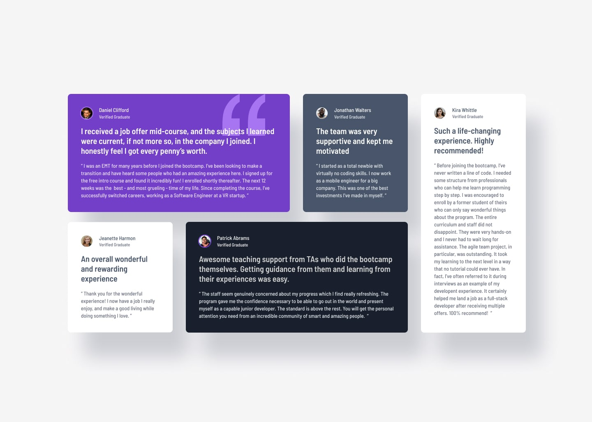

# Testimonials Grid



---

## Project Links & Badgest

[](https://02-junior-testimonials-grid.netlify.app/)  
[](https://github.com/arwinux/frontend-journey/tree/main/02-junior/testimonials-grid)  
[](https://www.frontendmentor.io/challenges/testimonials-grid-section-Nnw6J7Un7)  
[](https://opensource.org/licenses/MIT)  
[](https://github.com/arwinux)  
[](https://www.netlify.com)  
[](#)

---

## Overview

A responsive testimonials grid section built with CSS Grid. Displays five testimonial cards in a dynamic grid layout that adapts from single-column on mobile to a four-column layout on desktop.

### The challenge

- View an optimal layout depending on screen size
- See a responsive grid that rearranges cards across breakpoints
- Identify each testimonial author, their status, and their quote
- Distinguish cards by color-coded backgrounds (primary, secondary, light, dark)
- Read content with proper typographic hierarchy (name, title, quote)

### Links

- **Solution URL**: [GitHub Repository](https://github.com/arwinux/frontend-journey/tree/main/02-junior/testimonials-grid)
- **Live Site URL**: [Live Demo](https://02-junior-testimonials-grid.netlify.app/)

---

## My process

### Built with

- Semantic HTML5
- CSS Custom Properties
- CSS Grid
- Flexbox
- BEM naming convention
- Mobile-first workflow
- Responsive design

### Project Structure

```
testimonials-grid/
├── assets/
│   ├── fonts/
│   │   └── BarlowSemiCondensed/
│   └── images/
├── design/
├── src/
│   └── css/
│       ├── main.css
│       ├── reset.css
│       ├── typography.css
│       └── variable.css
├── index.html
├── preview.jpg
├── style-guide.md
└── README.md
```

### Continued development

- Improve keyboard navigation and focus indicators
- Add smooth transitions for card hover states
- Refactor CSS to reduce redundancy across breakpoints
- Fine-tune spacing and typography at intermediate breakpoints
- Add a dark mode toggle
- Optimize font loading with `font-display: swap`

### Useful resources

- [CSS Grid Guide (CSS-Tricks)](https://css-tricks.com/snippets/css/complete-guide-grid/) - Comprehensive reference for CSS Grid properties and terminology.
- [BEM Naming (Get BEM)](https://getbem.com/naming/) - Explanation of the BEM methodology used for class naming.
- [A Complete Guide to CSS Media Queries (CSS-Tricks)](https://css-tricks.com/a-complete-guide-to-css-media-queries/) - Practical guide for writing responsive breakpoints.
- [MDN Web Docs: CSS Custom Properties](https://developer.mozilla.org/en-US/docs/Web/CSS/Using_CSS_custom_properties) - Official documentation on CSS variables and their usage.
- [Frontend Mentor](https://www.frontendmentor.io) - Platform providing real-world HTML and CSS challenges for practice.

---

## Author

- Frontend Mentor - [@arwinux](https://www.frontendmentor.io/profile/arwinux)
- GitHub - [arwinux](https://github.com/arwinux)

---

## Acknowledgments

Thanks to Frontend Mentor for providing the design and challenge specifications. Appreciation also to the open-source community for maintaining the tools and resources that make projects like this possible.
