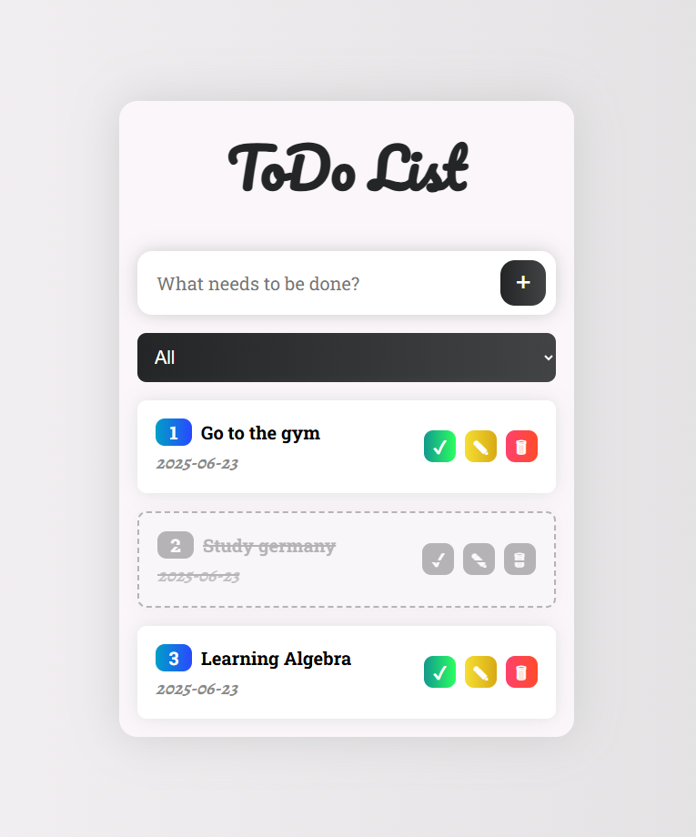
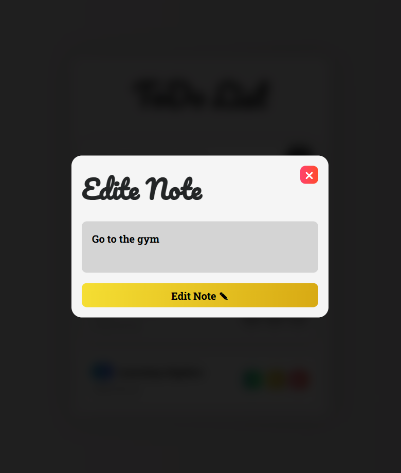

# 📝 Todo List

<div align="center">


|  |  |
|:----------------------:|:----------------------:|


_Where productivity meets elegance in a symphony of organization_ ✨

[](https://github.com/arwinux)
[](https://opensource.org/licenses/MIT)
[](https://arwinux.github.io/frontend-journey/02-junior/todolist/)


</div>

## 🎯 Welcome to Todo List

Step into a world where task management becomes an art form. Todo List is not just an application—it's a journey through productivity, where your tasks become beautifully organized elements in a clean, modern interface.

## ✨ Features

### 🌟 Core Features

- **Elegant Interface**: Navigate through a clean, modern UI with smooth animations and transitions
- **Dynamic Task Creation**: Add new tasks with a beautiful input interface
- **Task Management**: Mark tasks as complete with satisfying visual feedback
- **Smart Filtering**: Filter tasks by status (All, Completed, Active)
- **Date Tracking**: Each task comes with its creation date
- **Responsive Design**: Experience the app on any device, from mobile to desktop

### 🎨 Visual Elements

- **Modern Design**: A clean, minimalist interface that focuses on productivity
- **Smooth Animations**: Subtle transitions and hover effects
- **Gradient Accents**: Beautiful gradient buttons and interactive elements
- **Custom Typography**: Carefully selected fonts for optimal readability
- **Responsive Layout**: A flexible grid system that adapts to any screen size

### 🧩 Project Structure

```
📝 Todo List/
│
├── 📁 src/                      # Source code organization
│   ├── 📁 styles/               # CSS architecture
│   │   ├── 📄 main.css          # Primary stylesheet
│   │   ├── 📄 reset.css         # CSS normalization
│   │   ├── 📄 typography.css    # Text styling presets
│   │   └── 📄 variables.css     # Design tokens & fonts
│   │
│   ├── 📁 scripts/              # JavaScript modules
│   │   └── 📄 app.js            # Main application logic
│   │
│   └── 📁 assets/               # All project assets
│        │── 📁 fonts/           # Custom fonts
│        │    ├── 🗛 RobotoSlab.ttf
│        │   └── 🗛 Alegreya.ttf
│        │
│        └── 📁 images/          # Images and icons
│            └── 🖼️ preview.gif
│
├── 📄 index.html                # Main entry point
├── 📄 README.md                 # Project documentation
├── 📄 style-guide.md            # Design system specifications
├── 📄 .gitignore                # Version control exclusions
└── 📄 DEVELOPMENT.md            # Learning notes & challenges
```

## 🚀 Quick Start

### Prerequisites

- A modern web browser
- Basic understanding of HTML, CSS, and JavaScript

### Installation

1. Clone the repository:

```bash
git clone https://github.com/arwinux/frontend-journey.git
```

2. Navigate to the project directory:

```bash
cd frontend-journey/todolist
```

3. Open `index.html` in your browser or use a local server:

```bash
# Using Python
python -m http.server

# Using Node.js
npx serve
```

## 💫 Features in Detail

### Task Management

- **Create**: Add new tasks with a clean input interface
- **Complete**: Mark tasks as done with visual feedback
- **Delete**: Remove tasks with a confirmation step
- **Filter**: View tasks by their completion status
- **Track**: Each task includes its creation date

### Visual Effects

- **Smooth Transitions**: Experience seamless state changes
- **Hover Effects**: Interactive elements that respond to user input
- **Gradient Accents**: Beautiful gradient buttons and interactive elements
- **Responsive Design**: Optimized for all screen sizes

## 🛠️ Technical Stack

- **HTML5**: Semantic markup for structure
- **CSS3**: Modern styling with custom properties
- **JavaScript**: Clean, modular code
- **Custom Properties**: Theme variables for consistency
- **Responsive Design**: Mobile-first approach

## 🤝 Contributing

We welcome all contributors to help make Todo List better! Whether you're fixing bugs, adding features, or improving documentation, your contributions are valuable.

## 📝 License

This project is licensed under the MIT License - see the [LICENSE](LICENSE) file for details.

## 👨‍💻 Creator

- **Arvin Jafary** - [@Arwinux](https://github.com/arwinux)
  - _Frontend Developer & UI/UX Enthusiast_

## 🙏 Acknowledgments

- Inspired by modern productivity tools
- Built with clean code principles
- Special thanks to the open-source community
- Gratitude to all contributors

---

<div align="center">

_Made with ✨ by [Arvin Jafary](https://github.com/arwinux)_

_May your tasks be as organized as this list_ 📝

</div>
