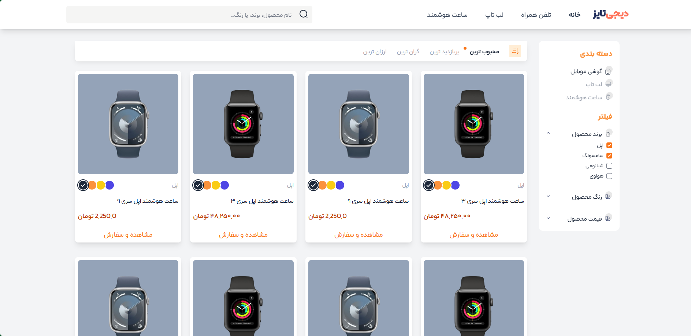
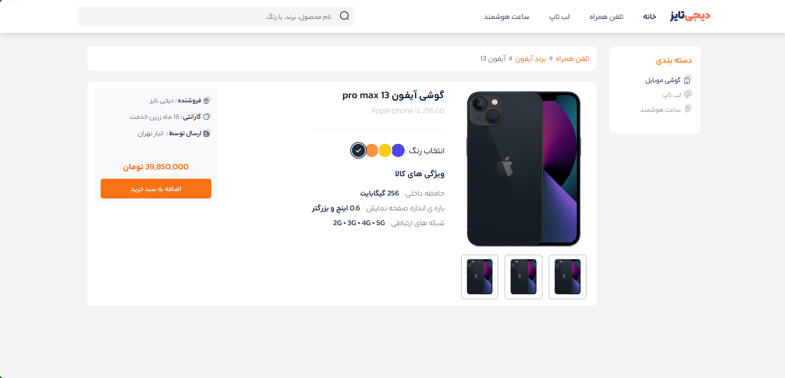
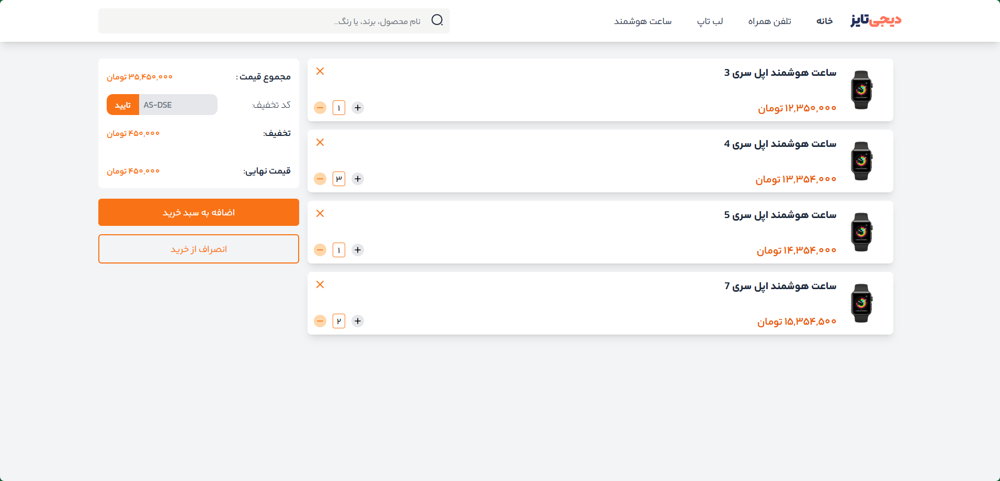

# 🛍️ Digitize Store

|  |
| :------------------------------------------------------------------------------------------------------------------------------: |

## Project Links & Badges

<div style="text-align:left;">

[](https://03-intermediate-digitize-store.netlify.app/)  
[](https://github.com/arwinux/frontend-journey/tree/main/03-intermediate/digitize-store)  
[](https://fronthooks.ir/)  
[](https://opensource.org/licenses/MIT)  
[](https://github.com/arwinux)  
[](https://www.netlify.com)  
[](#)

</div>

## 🎯 Welcome to Digitize Store

Step into the future of Persian e-commerce. **Digitize Store** is a modern, responsive e-commerce platform designed specifically for Persian-speaking users, featuring RTL layout, beautiful UI components, and seamless shopping experience.

## ✨ Features

### 🌟 Core Features

- **Modern E-commerce**: Complete shopping experience with product browsing, cart management, and checkout
- **Persian Language Support**: Full RTL (Right-to-Left) layout with Persian typography
- **Responsive Design**: Mobile-first approach that works beautifully on all devices
- **Product Management**: Browse products with filtering, sorting, and search capabilities
- **Shopping Cart**: Add items, manage quantities, and apply discount codes
- **Product Details**: Comprehensive product pages with image galleries and specifications

### 🎨 Visual Elements

- **Modern UI Design**: Clean, professional interface with orange brand colors
- **Tailwind CSS**: Utility-first styling for consistent design
- **Alpine.js Interactivity**: Smooth, reactive user interactions
- **Custom Persian Font**: IranYekan for authentic Persian text rendering
- **Responsive Components**: Cards, navigation, and forms that adapt to any screen
- **Color Selection**: Interactive product color pickers
- **Smooth Animations**: Subtle transitions and hover effects

### 🧩 Project Structure

```
📦 Digitize Store/
│
├── 📁 public/                    # Static files served to browser
│   ├── 📁 build/                # Compiled CSS files
│   │   └── tailwind.css         # Optimized Tailwind CSS
│   ├── 📄 index.html            # Home page with product grid
│   ├── 📄 cart.html             # Shopping cart page
│   └── 📄 singleproduct.html    # Product detail page
│
├── 📁 src/                      # Source files
│   ├── 📁 assets/              # Images, fonts, and other assets
│   │   ├── 📁 images/          # Product and UI images
│   │   │   ├── 📁 Cart/        # Cart-related images
│   │   │   ├── 📁 Home/        # Home page images
│   │   │   └── 📁 Single Product/ # Product detail images
│   │   └── 📁 fonts/           # Custom fonts
│   │
│   ├── 📁 css/                 # CSS source files
│   │   ├── tailwind.css        # Tailwind CSS imports
│   │   └── fonts.css           # Custom font definitions
│   │
│   └── 📁 js/                  # JavaScript files
│
├── 📁 node_modules/            # Dependencies
├── 📄 package.json             # Project configuration
├── 📄 tailwind.config.js       # Tailwind CSS configuration
├── 📄 postcss.config.js        # PostCSS configuration
├── 📄 DEVELOPMENT.md           # Development guide
├── 📄 style-guide.md           # Design system documentation
└── 📄 .gitignore              # Git ignore rules
```

## 🚀 Quick Start

### Prerequisites

- Node.js (v14 or higher)
- npm or yarn package manager
- Modern web browser

### Installation

1. **Clone the repository**:

2. **Navigate to the project directory**:

```bash
cd digitize-store
```

3. **Install dependencies**:

```bash
npm install
```

4. **Start development server**:

```bash
npm run dev
```

5. **Open in browser**:

```bash
npm run serve
```

## 💫 Features in Detail

### E-commerce Functionality

- **Product Browsing**: Grid layout with filtering by brand, color, and price
- **Search**: Find products by name, brand, or color
- **Category Navigation**: Browse by mobile phones, laptops, and smartwatches
- **Product Details**: View comprehensive product information with image galleries
- **Shopping Cart**: Add items, adjust quantities, and manage cart contents
- **Discount Codes**: Apply promotional codes for savings
- **Responsive Checkout**: Complete purchase process on any device

### Persian Language & RTL Support

- **RTL Layout**: Complete right-to-left text direction
- **Persian Typography**: Custom IranYekan font for authentic Persian text
- **Persian Numerals**: Native Persian number formatting
- **Cultural Design**: UI elements designed for Persian-speaking users

### Modern UI Components

- **Navigation**: Sticky desktop navigation and mobile bottom navigation
- **Product Cards**: Beautiful cards with color selection and pricing
- **Filter Sidebar**: Collapsible filters for brand, color, and price
- **Search Bar**: Integrated search with icon and placeholder text
- **Cart Interface**: Clean cart management with quantity controls
- **Responsive Grid**: Adaptive product grid that works on all screen sizes

## 🛠️ Technical Stack

- **HTML5**: Semantic markup with RTL support
- **Tailwind CSS**: Utility-first CSS framework for rapid UI development
- **Alpine.js**: Lightweight JavaScript framework for reactive components
- **PostCSS**: CSS processing and optimization
- **Live Server**: Development server with hot reload
- **IranYekan Font**: Custom Persian typography

## 🎨 Design System

### Color Palette

- **Primary Orange**: `#f97316` - Brand color for buttons and accents
- **Slate Gray**: `#1e293b` - Primary text and dark elements
- **Light Gray**: `#f1f5f9` - Background color
- **Orange Variants**: Light and dark shades for hover and active states

### Typography

- **Font Family**: IranYekan for authentic Persian text rendering
- **Font Sizes**: Responsive typography from `text-xs` to `text-lg`
- **Font Weights**: Bold, medium, normal, and light variants

### Components

- **Buttons**: Primary, secondary, and small button variants
- **Cards**: Product cards, cart items, and content containers
- **Forms**: Search inputs, discount code fields, and filters
- **Navigation**: Desktop navbar, mobile app bar, and bottom navigation

## 📱 Responsive Design

### Breakpoints

- **Mobile**: Default (320px+) - Mobile-first approach
- **Tablet**: `md:` (768px+) - Tablet and small desktop
- **Desktop**: `lg:` (1024px+) - Standard desktop
- **Large Desktop**: `xl:` (1280px+) - Large screens
- **2XL**: `2xl:` (1536px+) - Extra large displays

### Mobile Features

- **Bottom Navigation**: Easy thumb navigation for mobile users
- **Touch-Friendly**: Large touch targets and swipe gestures
- **Optimized Layout**: Stacked layouts that work on small screens
- **Fast Loading**: Optimized images and minimal JavaScript

## 🌐 Internationalization

### Persian Language Support

- **RTL Direction**: Complete right-to-left text flow
- **Persian Font**: IranYekan for proper Persian character rendering
- **Cultural Design**: UI elements designed for Persian-speaking markets
- **Localized Content**: Persian product names, descriptions, and UI text

## 🚀 Deployment

### Production Build

1. **Build optimized CSS**:

```bash
npm run prod
```

2. **Deploy `public/` directory** to your web server

### Recommended Hosting

- **Static hosting**: Netlify, Vercel, GitHub Pages
- **CDN**: For global performance optimization
- **HTTPS**: Required for modern web features and security

## 🤝 Contributing

We welcome contributions! Whether it's bug fixes, new features, or documentation improvements, your help is appreciated.

### How to Contribute

1. Fork the repository
2. Create a feature branch (`git checkout -b feature/amazing-feature`)
3. Commit your changes (`git commit -m 'Add amazing feature'`)
4. Push to the branch (`git push origin feature/amazing-feature`)
5. Open a Pull Request

### Development Guidelines

- Follow the established code style and conventions
- Test on multiple devices and browsers
- Ensure RTL layout works correctly
- Maintain Persian language support
- Update documentation as needed

## 👨‍💻 Creator

- **Arvin Jafary** - [@Arwinux](https://github.com/arwinux)
  - _Frontend Developer & UI/UX Enthusiast_
  - _Specializing in Persian web applications and modern e-commerce_

## 🙏 Acknowledgments

- **Tailwind CSS Team**: For the amazing utility-first CSS framework
- **Alpine.js Community**: For the lightweight reactive JavaScript framework
- **IranYekan Font**: For beautiful Persian typography
- **Open Source Community**: For inspiration and support
- **Persian E-commerce Community**: For feedback and suggestions

## 📚 Documentation

- **[Development Guide](./DEVELOPMENT.md)**: Complete development setup and workflow
- **[Style Guide](./style-guide.md)**: Design system and component patterns
- **[Package.json](./package.json)**: Project dependencies and scripts

<div align="center">

_Made with ✨ by [Arvin Jafary](https://github.com/arwinux)_

_May your digital store thrive in the Persian market_ 🛍️

</div>
