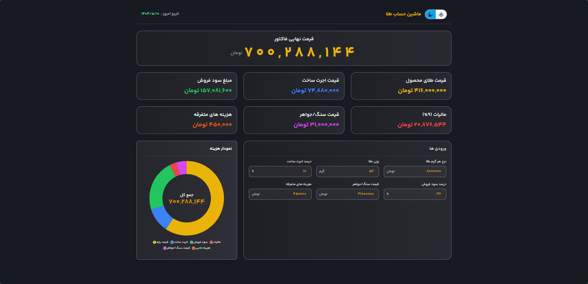
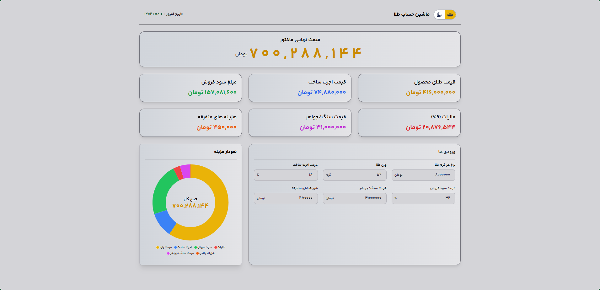

# 🏆 Gold Calculator

|  |
| :-------------------------------------------------------------------------------------------------------------------------------------: |

## Project Links & Badges

<div style="text-align:left;">

[](https://03-intermediate-gold-calculator.netlify.app/)  
[](https://github.com/arwinux/frontend-journey/tree/main/03-intermediate/gold-calculator)  
[](https://fronthooks.ir/)  
[](https://opensource.org/licenses/MIT)  
[](https://github.com/arwinux)  
[](https://www.netlify.com)  
[](#)

</div>

## 🎯 Welcome to Gold Calculator

Experience the future of gold price calculations. **Gold Calculator** is a sophisticated Persian/Farsi web application designed for accurate gold price calculations, featuring a modern interface with dark/light mode support and real-time data visualization.

## ✨ Features

### 🌟 Core Features

- **Real-time Price Calculation**: Instant gold price calculations with precision
- **Multiple Purity Levels**: Support for 18k, 21k, and 24k gold purity
- **Tax & Commission**: Comprehensive calculation including taxes and fees
- **Persian Language Support**: Full RTL layout with Persian typography
- **Dark/Light Mode**: Seamless theme switching with persistent preferences
- **Responsive Design**: Optimized for all devices and screen sizes

### 🎨 Visual Elements

- **Modern Dashboard**: Clean, intuitive interface with glassmorphism effects
- **Interactive Charts**: Beautiful data visualization with ApexCharts
- **Custom Persian Fonts**: YekanBakh font for authentic Persian typography
- **Smooth Animations**: Elegant transitions and hover effects
- **Consistent Design**: Cohesive color scheme and layout structure

### 🧩 Project Structure

```
📦 Gold Calculator/
│
├── 📁 public/                    # Public assets
│   ├── 📁 build/                 # Compiled CSS output
│   │   └── tailwind.css          # Processed Tailwind CSS
│   └── 📄 index.html             # Main HTML file
│
├── 📁 src/                       # Source code
│   ├── 📁 css/                   # CSS architecture
│   │   ├── tailwind.css          # Tailwind directives
│   │   └── fonts.css             # Custom Persian fonts
│   │
│   ├── 📁 js/                    # JavaScript logic
│   │   ├── main.js               # Main application logic
│   │   └── piechart.js           # Chart functionality
│   │
│   └── 📁 assets/                # Images and other assets
│        ├── 📁 images/           # Project images
│        └── 📁 fonts/            # buy yekanback font license
│
├── 📁 node_modules/              # Dependencies
├── 📄 package.json               # Project metadata & scripts
├── 📄 tailwind.config.js         # Tailwind configuration
├── 📄 postcss.config.js          # PostCSS configuration
├── 📄 .gitignore                 # Git ignore rules
├── 📄 README.md                  # Project documentation
├── 📄 DEVELOPMENT.md             # Development guide
└── 📄 style-guide.md             # Design system
```

## 🚀 Quick Start

### Prerequisites

- **Node.js** (v14 or higher)
- **npm** (v6 or higher)
- Modern web browser

### Installation

1. Clone the repository:

2. Navigate to the project directory:

```bash
cd gold-calculator
```

3. Install dependencies:

```bash
npm install
```

4. Start development server:

```bash
npm run dev
```

This will start the PostCSS watcher that compiles Tailwind CSS to `public/build/tailwind.css`.

5. Open your browser and navigate to `public/index.html`

### Build for Production

```bash
npm run prod
```

This command will:

- Set NODE_ENV to production
- Compile and minify CSS using CSSNano
- Output optimized CSS to `public/build/tailwind.css`

## 💫 Features in Detail

### Price Calculation Engine

- **Weight-based Calculations**: Precise calculations based on gold weight in grams
- **Purity Multipliers**: Accurate pricing for different gold purity levels
- **Tax Integration**: Automatic tax calculations and inclusion
- **Commission Handling**: Built-in commission and fee calculations
- **Real-time Updates**: Instant price updates as you input values

### User Interface

- **Persian RTL Layout**: Authentic Persian language experience
- **Theme Toggle**: Switch between dark and light modes seamlessly
- **Responsive Grid**: Adaptive layout for all screen sizes
- **Interactive Elements**: Hover effects and smooth transitions
- **Accessibility**: Full keyboard navigation and screen reader support

### Data Visualization

- **Pie Charts**: Visual breakdown of price components
- **Real-time Updates**: Charts update dynamically with calculations
- **Dark Mode Support**: Charts adapt to current theme
- **Persian Labels**: All chart labels in Persian language

## 🛠️ Technical Stack

- **HTML5**: Semantic markup with RTL support
- **CSS3**: Tailwind CSS with custom Persian fonts
- **JavaScript**: ES6+ with modular architecture
- **PostCSS**: CSS processing with Autoprefixer and CSSNano
- **ApexCharts**: Interactive data visualization
- **Responsive Design**: Mobile-first approach

### Key Dependencies

```json
{
  "apexcharts": "^5.3.2",
  "tailwindcss": "^3.4.17",
  "postcss-cli": "^11.0.1",
  "autoprefixer": "^10.4.21"
}
```

## 🎨 Design System

### Color Palette

- **Gold/Yellow**: `#f59e0b` - Primary gold elements
- **Blue**: `#3b82f6` - Primary actions and links
- **Gray**: `#6b7280` - Neutral text and borders
- **Green**: `#10b981` - Success states
- **Red**: `#ef4444` - Error states
- **Zinc**: `#71717a` - Dark mode backgrounds

### Typography

- **Primary Font**: YekanBakh (Persian)
- **Font Weights**: 400 (normal), 500 (medium), 600 (semibold), 700 (bold)
- **Responsive Sizes**: `text-xs` to `text-7xl`

### Breakpoints

- **Mobile**: `sm` (640px+)
- **Tablet**: `md` (768px+)
- **Desktop**: `lg` (1024px+)
- **Large Desktop**: `xl` (1280px+)
- **Extra Large**: `2xl` (1536px+)

## 🔧 Configuration

### Tailwind Configuration

```javascript
module.exports = {
  darkMode: "selector",
  content: ["./public/**/*.{html,js}", "./src/js/**/*.js"],
  theme: {
    extend: {
      fontFamily: {
        sans: ["yekanback"],
      },
    },
  },
  plugins: [require("@tailwindcss/forms")],
};
```

### PostCSS Configuration

```javascript
module.exports = {
  plugins: {
    tailwindcss: {},
    autoprefixer: {},
    ...(process.env.NODE_ENV === "production" ? { cssnano: {} } : {}),
  },
};
```

## 🧪 Testing

### Manual Testing Checklist

- Price calculations accuracy across all purity levels
- Dark/light mode toggle functionality
- Responsive design on all breakpoints
- RTL layout correctness
- Chart functionality and responsiveness
- Form validation and error handling
- Accessibility features (keyboard navigation, screen readers)
- Persian number formatting
- Cross-browser compatibility

### Browser Support

- ✅ Chrome (latest)
- ✅ Firefox (latest)
- ✅ Safari (latest)
- ✅ Edge (latest)
- ✅ Mobile browsers (iOS Safari, Chrome Mobile)

## 🤝 Contributing

We welcome contributions! Please read our [DEVELOPMENT.md](./DEVELOPMENT.md) and [style-guide.md](./style-guide.md) for guidelines.

### How to Contribute

1. Fork the repository
2. Create a feature branch (`git checkout -b feature/amazing-feature`)
3. Commit your changes (`git commit -m 'Add amazing feature'`)
4. Push to the branch (`git push origin feature/amazing-feature`)
5. Open a Pull Request

## 📝 License

This project is licensed under the MIT License - see the [LICENSE](LICENSE) file for details.

## 👨‍💻 Creator

- **Arvin Jafary** - [@arwinux](https://github.com/arwinux)
  - _Frontend Developer & UI/UX Enthusiast_
  - _Specialized in Persian/Farsi web applications_

## 🙏 Acknowledgments

- Inspired by the need for accurate gold price calculations
- Built with modern web technologies and best practices
- Thanks to the Tailwind CSS and ApexCharts communities
- Special thanks to all contributors and users
- Persian typography support with YekanBakh font

## 📚 Documentation

- [Development Guide](./DEVELOPMENT.md) - Complete development documentation
- [Style Guide](./style-guide.md) - Design system and coding standards
- [Configuration Files](./tailwind.config.js) - Tailwind and PostCSS setup

---

<div align="center">

_Made with ✨ by [Arvin Jafary](https://github.com/arwinux)_

_May your gold calculations always be precise_ 🏆

</div>
