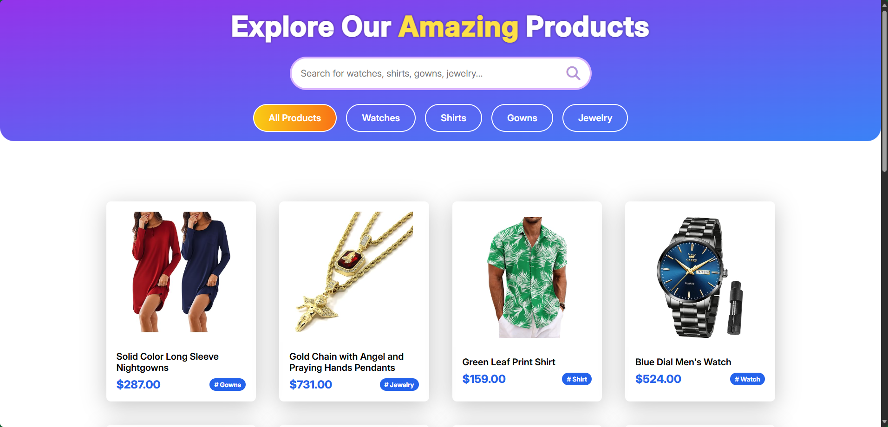

# 🛍️ Product Filter



## Project Links & Badges

<div style="text-align:left;">

[](https://03-intermediate-product-filter.netlify.app/)  
[](https://github.com/arwinux/frontend-journey/tree/main/03-intermediate/product-filter)  
[](https://fronthooks.ir)  
[](https://opensource.org/licenses/MIT)  
[](https://github.com/arwinux)  
[](https://www.netlify.com)  
[](#)

</div>

## 🎯 Welcome to Product Filter

Step into a world where online shopping becomes an art form. Product Filter is a clean, modern web app for browsing and filtering products by category or search, with a beautiful responsive design and smooth user experience.

## ✨ Features

### 🌟 Core Features

- **Elegant Interface**: Browse a clean, modern product grid with smooth transitions
- **Live Search**: Instantly filter products by name as you type
- **Category Filtering**: Filter products by Watches, Shirts, Gowns, or Jewelry
- **Responsive Design**: Enjoy the app on any device, from mobile to desktop
- **No Server Required**: Works directly in the browser without any backend setup

### 🎨 Visual Elements

- **Modern Design**: Minimalist, user-focused interface
- **Smooth Animations**: Subtle transitions and hover effects
- **Vivid Accents**: Purple highlights and interactive elements
- **Custom Typography**: Carefully selected fonts for readability
- **Responsive Layout**: Flexible grid system adapts to all screens

### 🧩 Project Structure

```
🛍️ Product Filter/
│
├── 📁 src/                      # Source code organization
│   ├── 📁 styles/               # CSS architecture
│   │   ├── 📄 main.css          # Primary stylesheet
│   │   ├── 📄 reset.css         # CSS normalization
│   │   ├── 📄 typography.css    # Text styling presets
│   │   └── 📄 variables.css     # Design tokens & fonts
│   │
│   ├── 📁 scripts/              # JavaScript modules
│   │   └── 📄 app.js            # Main application logic
│   │
│   ├── 📁 data/                 # Product data (JSON)
│   │   └── 📄 db.json           # Product list
│   │
│   └── 📁 assets/               # All project assets
│        ├── 📁 fonts/           # Custom fonts
│        └── 📁 images/          # Product images
│
├── 📁 design/                   # UI/UX design previews
│   ├── 🖼️ preview1.png          # Product Grid preview
│   └── 🖼️ preview2.png          # Filter UI preview
│
├── 📄 index.html                # Main entry point
├── 📄 README.md                 # Project documentation
├── 📄 style-guide.md            # Design system specifications
├── 📄 .gitignore                # Version control exclusions
└── 📄 DEVELOPMENT.md            # Learning notes & challenges
```

## 🚀 Quick Start

### Prerequisites

- A modern web browser (Chrome, Firefox, Safari, Edge)
- No server setup required!

### Installation

1. **Clone the repository:**

   ```bash
   git clone https://github.com/yourusername/product-filter.git
   ```

2. **Navigate to the project directory:**

   ```bash
   cd product-filter
   ```

3. **Open the application:**

   **Option A: Direct browser opening (Recommended)**

   ```bash
   # Simply double-click index.html or open it in your browser
   # The app will work immediately with fallback data
   ```

   **Option B: Local server (For development)**

   ```bash
   # Using Python
   python -m http.server

   # Using Node.js
   npx serve

   # Then open http://localhost:8000 or http://localhost:3000
   ```

4. **Test the application:**
   ```bash
   # Open test.html in your browser to verify everything works
   ```

## 🧪 Testing

The project includes a test page (`test.html`) that verifies:

- ✅ All required files are present
- ✅ Data loading works correctly
- ✅ No external dependencies are needed

Open `test.html` in your browser to run the verification tests.

## 💫 Features in Detail

### Product Filtering

- **Live Search**: Filter products by typing keywords in the search bar
- **Category Filter**: Instantly show only Watches, Shirts, Gowns, or Jewelry
- **All Products**: View the complete product list with one click

### Visual Effects

- **Smooth Transitions**: Enjoy seamless UI changes
- **Hover Effects**: Interactive elements respond to your actions
- **Vivid Accents**: Purple highlights for key actions
- **Responsive Design**: Optimized for all screen sizes

### Data Loading

- **Primary**: Loads data from `src/data/db.json`
- **Fallback**: Uses embedded data if file loading fails
- **No Dependencies**: Works without any external libraries or servers

## 🛠️ Technical Stack

- **HTML5**: Semantic markup for structure
- **CSS3**: Modern styling with custom properties
- **JavaScript**: Clean, modular code with native fetch API
- **FontAwesome**: Iconography for clarity
- **Responsive Design**: Mobile-first approach

## 🤝 Contributing

We welcome all contributors to help make Product Filter better! Whether you're fixing bugs, adding features, or improving documentation, your contributions are valuable.

## 📝 License

This project is licensed under the MIT License - see the [LICENSE](LICENSE) file for details.

## 👨‍💻 Creator

- **Arvin Jafary** - [@Arwinux](https://github.com/arwinux)
  - _Frontend Developer & UI/UX Enthusiast_

## 🙏 Acknowledgments

- Inspired by modern e-commerce experiences
- Built with clean code principles
- Special thanks to the open-source community
- Gratitude to all contributors

---

<div align="center">

_Made with ✨ by [Arvin Jafary](https://github.com/arwinux)_

_May your shopping be as smooth as this filter_ 🛍️

</div>
