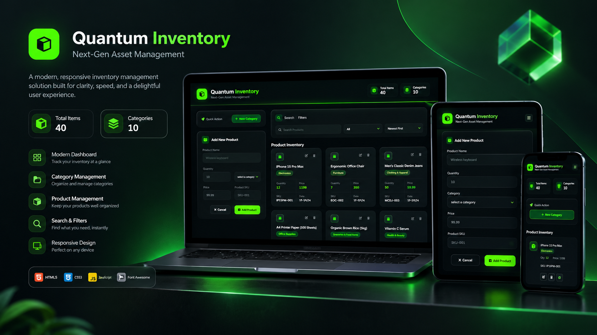

# Quantum Inventory



---

## Project Links & Badges

[](https://arwinux.github.io/frontend-journey/03-intermediate/quantum-inventory-modern/)  
[](https://github.com/arwinux/frontend-journey/tree/main/03-intermediate/quantum-inventory-modern)  
[](#)  
[](https://opensource.org/licenses/MIT)  
[](https://github.com/arwinux)  
[](#)  
[](#)

---

## Overview

Quantum Inventory is a responsive inventory and asset management app built with semantic HTML, modular CSS, and ES6 JavaScript. It helps you organize products into categories and track quantity, price, and SKU. Data is persisted in the browser's `localStorage`.

### The challenge

Users should be able to:

- Add product categories with a name and a description
- Add products with name, quantity, price, SKU, and category
- View a dashboard showing total items and category counts
- Search products by name
- Filter products by category and sort by date, name, quantity, or price
- Edit and delete existing products

### Links

- **Solution URL:** [GitHub Repository](https://github.com/arwinux/frontend-journey/tree/main/03-intermediate/quantum-inventory-modern)
- **Live Site URL:** [Live demo](https://arwinux.github.io/frontend-journey/03-intermediate/quantum-inventory-modern/)

## My process

### Built with

- Semantic HTML5
- CSS Custom Properties
- Flexbox
- CSS Grid
- ES6 JavaScript modules
- `localStorage` persistence
- Font Awesome icons
- Self-hosted Inter font
- Glassmorphism UI
- Responsive design

### Project Structure

```
quantum-inventory-modern/
├── index.html
├── preview.png
├── package.json
├── design/
│   └── arwinux.jpg
└── src/
    ├── assets/
    │   └── fonts/Inter/
    ├── components/
    │   ├── btn.html
    │   ├── input.html
    │   ├── logo.html
    │   └── title.html
    ├── scripts/
    │   ├── CategoryView.js
    │   ├── ProductView.js
    │   ├── Storage.js
    │   ├── programmer-badge.js
    │   └── main.js
    └── styles/
        ├── main.css
        ├── reset.css
        ├── variables.css
        ├── typography.css
        ├── components.css
        ├── layout.css
        ├── utilities.css
        └── media-queries.css
```

### Continued development

- Seed initial categories and products on first load
- Add category editing and deletion
- Add input validation with inline error messages
- Confirm before deleting a product
- Add a dark mode toggle
- Improve keyboard navigation and ARIA support for the modal

### Useful resources

- [MDN Web Docs](https://developer.mozilla.org/) — HTML, CSS, and JavaScript reference.
- [CSS-Tricks](https://css-tricks.com/) — Practical CSS layout and component patterns.
- [web.dev](https://web.dev/) — Performance, accessibility, and responsive design guidance.
- [Font Awesome](https://docs.fontawesome.com/) — Icon usage and reference.

## Author

- GitHub - https://github.com/arwinux

## Acknowledgments

Built as a Fronthooks challenge and part of the [frontend-journey](https://github.com/arwinux/frontend-journey) learning repository.
