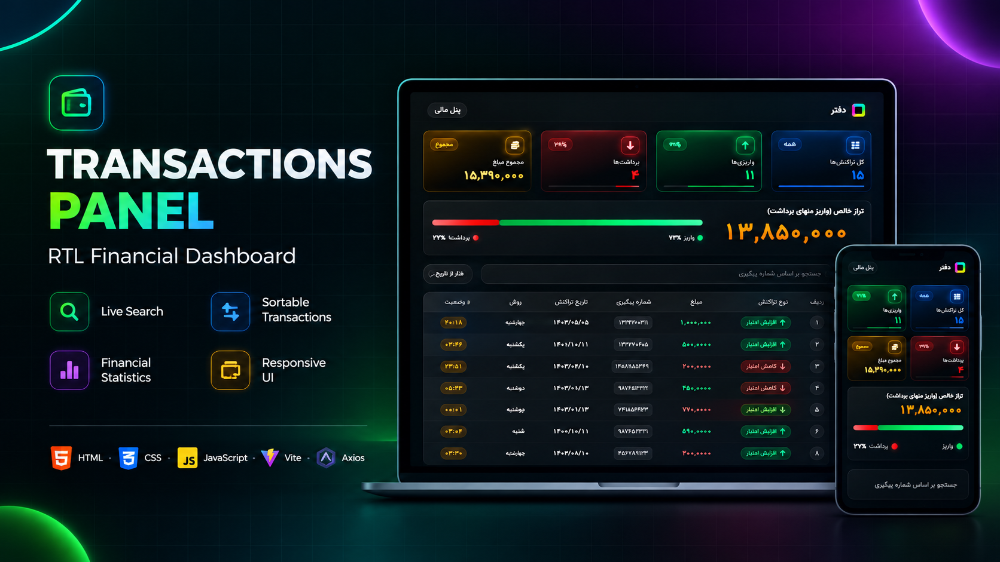

# Transactions Panel



---

## Project Links & Badges

[](#)  
[](https://github.com/arwinux/frontend-journey/tree/main/03-intermediate/transactions-panel-modern)  
[](#)  
[](https://opensource.org/licenses/MIT)  
[](https://github.com/arwinux)  
[](#)  
[](#)

---

## Overview

Transactions Panel is a responsive RTL financial dashboard built with vanilla JavaScript and Vite. It loads banking transactions from a local JSON server and presents them in a Persian-language table with live statistics. Users can search transactions by tracking number and sort them by amount or date.

## Features

- Load transactions from a local API with a loading state
- Stats board with total, deposit, and withdrawal counts
- Total and deposit amounts formatted in Persian digits
- Deposit and withdrawal percentage meters
- Search transactions by tracking number
- Sort by amount or date in both directions
- RTL Persian interface with the self-hosted Vazirmatn font

### Links

- **Solution URL:** [GitHub Repository](https://github.com/arwinux/frontend-journey/tree/main/03-intermediate/transactions-panel-modern)

## Getting Started

1. Install dependencies:

   ```bash
   npm install
   ```

2. Start the JSON server on port 3000:

   ```bash
   npm run server
   ```

3. Start the Vite dev server:

   ```bash
   npm run dev
   ```

## My process

### Built with

- Semantic HTML5
- CSS Custom Properties
- Flexbox
- CSS Grid
- ES6 JavaScript modules
- Vite
- axios
- json-server
- Font Awesome icons
- Self-hosted Vazirmatn font
- Responsive design

### Project Structure

```
transactions-panel-modern/
├── index.html
├── package.json
├── data/
│   └── db.json
├── public/
│   ├── favicon.svg
│   └── icons.svg
└── src/
    ├── assets/
    │   └── fonts/vazirmatn/
    ├── css/
    │   ├── main.css
    │   ├── reset.css
    │   ├── variable.css
    │   ├── typography.css
    │   └── layout.css
    └── js/
        ├── main.js
        ├── Model/
        │   └── Transaction.js
        ├── Service/
        │   ├── ApiService.js
        │   ├── TransactionsService.js
        │   └── TransactionStats.js
        └── Ui/
            ├── StatsBoard.js
            ├── TransactionTable.js
            └── TransactionUi.js
```

### Continued development

- Show an error state when the API is unreachable
- Cache loaded data in `localStorage` to avoid refetching
- Add pagination for large datasets
- Add CSV export of transactions
- Add filters by transaction type
- Improve keyboard navigation and ARIA labels

### Useful resources

- [MDN Web Docs](https://developer.mozilla.org/) — HTML, CSS, and JavaScript reference.
- [web.dev](https://web.dev/) — Performance and accessibility guidance.
- [Vite](https://vite.dev/) — Build tool and development server.
- [json-server](https://github.com/typicode/json-server) — Local REST API for the transaction data.
- [axios](https://axios-http.com/) — HTTP client used for API requests.

## Author

- GitHub - https://github.com/arwinux

## Acknowledgments

Built as part of the [frontend-journey](https://github.com/arwinux/frontend-journey) learning repository.
