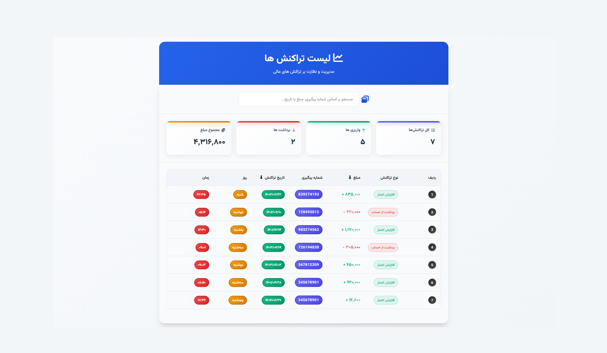

# 💰 Transactions Panel

<div align="center">



_Where financial management meets simplicity in a symphony of design_ ✨

  

</div>
A modern, responsive web application for managing and monitoring financial transactions with real-time statistics and advanced filtering capabilities.

## 🚀 Live Demo

**Netlify Deployment**: [View Live Demo](https://your-netlify-url.netlify.app)

## ✨ Features

- **📊 Real-time Statistics Dashboard**

  - Total transactions count
  - Deposit transactions count
  - Withdrawal transactions count
  - Total amount calculation

- **🔍 Advanced Search & Filtering**

  - Search by tracking number, amount, or date
  - Sort transactions by amount (ascending/descending)
  - Sort transactions by date (ascending/descending)

- **📱 Responsive Design**

  - Mobile-first approach
  - Adaptive layout for all screen sizes
  - Touch-friendly interface

- **🎨 Modern UI/UX**

  - Persian/Farsi language support
  - RTL (Right-to-Left) layout
  - Beautiful gradient backgrounds
  - Smooth animations and transitions
  - Custom Vazirmatn font family

- **⚡ Performance Optimized**
  - Static data for fast loading
  - Client-side filtering and sorting
  - Optimized rendering

## 🛠️ Technologies Used

- **Frontend**

  - HTML5
  - CSS3 (Custom Properties, Flexbox, Grid)
  - Vanilla JavaScript (ES6+)

- **Styling**

  - Custom CSS with CSS Variables
  - Responsive design patterns
  - Modern CSS features (Grid, Flexbox)
  - Custom font integration (Vazirmatn)

- **Data Management**
  - Static JSON data
  - Client-side filtering and sorting

## 🚀 Installation & Deployment

### Local Development

1. **Clone the repository**

   ```bash
   git clone https://github.com/arwinux/transactions-panel.git
   cd transactions-panel
   ```

2. **Install dependencies**

   ```bash
   npm install
   ```

3. **Run locally**

   ```bash
   npm run dev
   ```

4. **Open the application**
   - Open `index.html` in your browser
   - Or visit `http://localhost:3000` if using serve

### Netlify Deployment

1. **Push to GitHub**

   ```bash
   git add .
   git commit -m "Prepare for Netlify deployment"
   git push origin main
   ```

2. **Deploy to Netlify**
   - Connect your GitHub repository to Netlify
   - Set build settings:
     - Build command: `echo 'Static site - no build required'`
     - Publish directory: `.`
   - Deploy!

## 📖 Usage

1. **Load Transactions**

   - Click the "بارگذاری تراکنش ها" (Load Transactions) button
   - The dashboard will display all transaction data

2. **View Statistics**

   - Total transactions count
   - Deposit transactions (green)
   - Withdrawal transactions (red)
   - Total amount (yellow)

3. **Search Transactions**

   - Use the search box to find transactions by:
     - Tracking number
     - Amount
     - Date

4. **Sort Transactions**
   - Click on "مبلغ" (Amount) to sort by price
   - Click on "تاریخ تراکنش" (Transaction Date) to sort by date
   - Toggle between ascending and descending order

## 📁 Project Structure

```
💰 Transactions-Panel/
│
├── 📁 src/                      # Source code organization
│   ├── 📁 styles/               # CSS architecture
│   │   ├── 📄 main.css          # Primary stylesheet
│   │   ├── 📄 components.css   # Component styles
│   │   ├── 📄 reset.css         # CSS normalization
│   │   ├── 📄 typography.css    # Text styling presets
│   │   └── 📄 variables.css     # Design tokens & fonts
│   │
│   ├── 📁 scripts/              # JavaScript modules
│   │   └── 📄 app.js            # Main application logic
│   │
│   └── 📁 assets/               # All project assets
│        └── 📁 fonts/           # Custom fonts
│
├── 📁 design/                   # UI/UX design previews
│   └── 🖼️ preview.png          # Product Grid preview
│
├── 📄 index.html                # Main entry point
├── 📄 netlify.toml              # Netlify configuration
├── 📄 README.md                 # Project documentation
├── 📄 style-guide.md            # Design system specifications
├── 📄 .gitignore                # Version control exclusions
└── 📄 DEVELOPMENT.md            # Learning notes & challenges
```

## 🎯 Key Components

### Classes Overview

- **`Product`**: Data model for transactions
- **`ProductServices`**: Static data management
- **`FilterProduct`**: Sorting and filtering logic
- **`SearchProduct`**: Search functionality
- **`ProdcutStatics`**: Statistics calculations
- **`Ui`**: User interface management
- **`App`**: Main application controller

### Styling System

- **CSS Variables**: Centralized design tokens
- **Component-based**: Modular CSS architecture
- **Responsive**: Mobile-first approach
- **RTL Support**: Persian language optimization

## 🌟 Features in Detail

### Statistics Dashboard

- Real-time calculation of transaction metrics
- Color-coded indicators for different transaction types
- Hover effects and smooth animations

### Search Functionality

- Real-time search as you type
- Search across multiple fields
- Instant results display

### Sorting System

- Toggle between ascending and descending order
- Visual indicators for sort direction
- Smooth icon rotation animations

### Responsive Design

- Adaptive grid layouts
- Mobile-optimized table view
- Touch-friendly interactions

## 🔧 Customization

### Adding New Transactions

1. Edit the `staticTransactions` array in `src/scripts/app.js`
2. Add new transaction objects with the required fields
3. The application will automatically update

### Styling Modifications

- Edit `variables.css` for color scheme changes
- Modify `components.css` for component styling
- Update `typography.css` for font changes

## 📱 Browser Support

- Chrome (latest)
- Firefox (latest)
- Safari (latest)
- Edge (latest)
- Mobile browsers

## 🤝 Contributing

1. Fork the repository
2. Create a feature branch (`git checkout -b feature/AmazingFeature`)
3. Commit your changes (`git commit -m 'Add some AmazingFeature'`)
4. Push to the branch (`git push origin feature/AmazingFeature`)
5. Open a Pull Request

## 📄 License

This project is licensed under the MIT License - see the [LICENSE](LICENSE) file for details.

## 👨‍💻 Author

**Arvin Jafary**

- GitHub: [@arwinux](https://github.com/arwinux)
- LinkedIn: [Your LinkedIn](https://linkedin.com/in/arwinux)

## 🙏 Acknowledgments

- [Vazirmatn Font](https://github.com/rastikerdar/vazirmatn) - Beautiful Persian font
- [Font Awesome](https://fontawesome.com/) - Icon library
- [Netlify](https://netlify.com/) - Hosting platform

---

⭐ If you found this project helpful, please give it a star!
