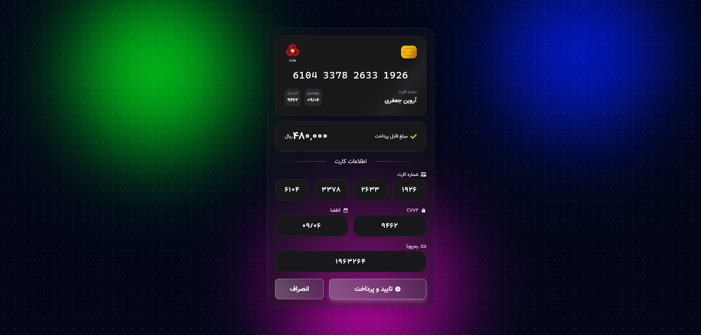

# 💳 Bank Payment Gateway

|  |
| :---------------------------------------: |

## Project Links & Badges

<div style="text-align:left;">

[](https://04-advanced-bank-payment-gateway.netlify.app/)  
[](https://github.com/arwinux/frontend-journey/tree/main/04-advanced/bank-payment-gateway)  
[](#)  
[](https://opensource.org/licenses/MIT)  
[](https://github.com/arwinux)  
[](https://www.netlify.com)  
[](#)

</div>

## 🎯 Welcome to Bank Payment Gateway

Experience seamless payment card management and validation. **Bank Payment Gateway** is a modern React application that provides real-time bank detection, card number validation, and an interactive credit card interface with support for Iranian banks.

## ✨ Features

### 🌟 Core Features

- **Automatic Bank Detection**: Identifies Iranian banks by card number (BIN detection)
- **Real-time Card Validation**: Instant validation as you type card details
- **Interactive Card Component**: Beautiful animated card display with bank logo
- **Card Number Formatting**: Automatic formatting of card numbers in groups of 4
- **Expiry Date Formatting**: Smart date formatting with automatic slash insertion
- **CVV2 & OTP Support**: Complete payment security fields
- **Responsive Design**: Optimized for all devices and screen sizes

### 🎨 Visual Elements

- **Modern Card Design**: Glassmorphic credit card interface with chip visualization
- **Bank Logos**: Dynamic bank logo display based on detected bank
- **Dark Mode Theme**: Sleek dark theme with golden accents
- **Smooth Animations**: Elegant transitions and hover effects
- **Persian Support**: Full RTL support with Persian typography
- **Icon Integration**: Beautiful icons from react-icons library

### 🧩 Project Structure

```
📦 Bank Payment Gateway/
│
├── 📁 public/                    # Public assets
│   └── 📁 fonts/                 # Font files
│       ├── Cascadia_Code/        # Monospace font for card numbers
│       └── Vazir/                # Persian Vazir font
│
├── 📁 src/                       # Source code
│   ├── 📄 main.jsx               # React entry point
│   ├── 📄 App.jsx                # Main application component
│   ├── 📄 App.css                # Application styles
│   │
│   ├── 📁 Components/            # React components
│   │   └── Card.jsx              # Credit card component
│   │
│   ├── 📁 styles/                # Global styles
│   │   ├── fonts.css             # Font declarations
│   │   └── variables.css         # CSS variables
│   │
│   ├── 📁 utils/                 # Utility functions
│   │   ├── splitEveryFour.js     # Split string every 4 chars
│   │   └── splitEveryThree.js    # Split string every 3 chars
│   │
│   └── 📁 assets/                # Images and assets
│
├── 📁 node_modules/              # Dependencies
├── 📄 package.json               # Project metadata & scripts
├── 📄 vite.config.js             # Vite configuration
├── 📄 tailwind.config.js         # Tailwind CSS configuration
├── 📄 eslint.config.js           # ESLint configuration
├── 📄 index.html                 # Main HTML file
├── 📄 .gitignore                 # Git ignore rules
└── 📄 README.md                  # Project documentation
```

## 🚀 Quick Start

### Prerequisites

- **Node.js** (v16 or higher)
- **npm** (v7 or higher) or **yarn**
- Modern web browser

### Installation

1. Clone the repository:

```**bash**
cd bank-payment-gateway
```

2. Install dependencies:

```bash
npm install
```

3. Start development server:

```bash
npm run dev
```

The application will be available at `http://localhost:5173` (or the next available port).

### Build for Production

```bash
npm run build
```

This command will:

- Compile React components
- Optimize and bundle assets
- Generate production-ready files in the `dist/` directory

### Preview Production Build

```bash
npm run preview
```

## 💫 Features in Detail

### Bank Detection System

- **BIN Recognition**: Detects Iranian banks using the first 6 digits of card number
- **Logo Display**: Shows bank logo and name in real-time
- **Comprehensive Database**: Support for all major Iranian banks via `iran-bank-detector` package
- **Dynamic Updates**: Bank information updates instantly as card number is entered

### Card Input Management

- **Four-part Card Entry**: Split input fields for secure card number entry
- **Auto-formatting**: Card numbers automatically formatted as XXXX XXXX XXXX XXXX
- **Number-only Input**: Invalid characters are filtered out automatically
- **Real-time Validation**: Cards validated as user types

### Card Component

- **Visual Card Display**: Beautiful animated credit card with:
  - Chip visualization with gradient effects
  - Bank logo and name display
  - Card number with masked placeholder
  - Cardholder name
  - Expiry date display
  - CVV2 indication

### Expiry Date Handling

- **Smart Formatting**: Automatically formats to MM/YY format
- **Input Validation**: Accepts only numeric input
- **Automatic Slash**: Inserts slash after 2 digits

### Security Fields

- **CVV2 Support**: 3-digit security code input
- **OTP Field**: One-time password input for two-factor authentication
- **Masked Display**: Sensitive data masked in preview

## 🛠️ Technical Stack

- **React**: v19.2.4 - Modern UI library
- **Vite**: v8.0.4 - Fast build tool and dev server
- **Tailwind CSS**: v4.3.0 - Utility-first CSS framework
- **React Icons**: v5.6.0 - Comprehensive icon library
- **iran-bank-detector**: v1.0.5 - Bank detection by card number
- **ESLint**: Static code analysis tool

### Key Dependencies

```json
{
  "react": "^19.2.4",
  "react-dom": "^19.2.4",
  "tailwindcss": "^4.3.0",
  "@tailwindcss/vite": "^4.3.0",
  "react-icons": "^5.6.0",
  "iran-bank-detector": "^1.0.5"
}
```

## 🎨 Design System

### Color Palette

- **Primary Gold**: `#f59e0b` - Accent and highlights
- **Dark Background**: `#18181b` - Dark theme base
- **Zinc Gray**: `#71717a` - Neutral text and borders
- **White**: `#ffffff` - Primary text on dark backgrounds

### Typography

- **Primary Font**: Vazir (Persian)
- **Card Font**: Cascadia Code (Monospace for card numbers)
- **Font Weights**: 400 (normal), 500 (medium), 600 (semibold), 700 (bold)

### Breakpoints

- **Mobile**: `xs` (320px+)
- **Small**: `sm` (640px+)
- **Medium**: `md` (768px+)
- **Large**: `lg` (1024px+)
- **Extra Large**: `xl` (1280px+)

## 🧪 Testing

### Manual Testing Checklist

- ✅ Card number input and formatting
- ✅ Bank detection and logo display
- ✅ Expiry date formatting (MM/YY)
- ✅ CVV2 and OTP input handling
- ✅ Responsive design on mobile, tablet, and desktop
- ✅ RTL and LTR text support
- ✅ Input validation and masking
- ✅ Cross-browser compatibility

### Browser Support

- ✅ Chrome (latest)
- ✅ Firefox (latest)
- ✅ Safari (latest)
- ✅ Edge (latest)
- ✅ Mobile browsers (iOS Safari, Chrome Mobile)

## 🔍 Usage Example

```jsx
import App from "./App";

// The App component manages all payment gateway logic
// Input your card details and watch real-time bank detection

function main() {
  return <App />;
}
```

### Input Card Details:

1. **Card Number**: Enter 16-digit card number (auto-formatted in 4-digit groups)
2. **Expiry Date**: Enter expiry in MM/YY format
3. **CVV2**: Enter 3-digit security code
4. **OTP**: Enter one-time password for verification
5. **Cardholder Name**: Enter name as it appears on card

## 🎯 Component Architecture

### Card Component

Displays the interactive credit card with:

- Bank logo and name (auto-detected)
- 16-digit card number (masked until entered)
- Cardholder name
- Expiry date
- CVV2 indicator
- Animated chip design

### Utility Functions

- **`splitEveryFour.js`**: Splits strings into groups of 4 characters
- **`splitEveryThree.js`**: Splits strings into groups of 3 characters

These utilities help format card numbers and other numerical inputs for better readability.

## 🔧 Configuration

### Vite Configuration

```javascript
import { defineConfig } from "vite";
import react from "@vitejs/plugin-react";

export default defineConfig({
  plugins: [react()],
});
```

### Tailwind Configuration

Configured with Vite integration for automatic style generation and hot module replacement.

## 🤝 Contributing

We welcome contributions! Please follow these steps:

1. Fork the repository
2. Create a feature branch (`git checkout -b feature/amazing-feature`)
3. Commit your changes (`git commit -m 'Add amazing feature'`)
4. Push to the branch (`git push origin feature/amazing-feature`)
5. Open a Pull Request

## 📝 License

This project is licensed under the MIT License - see the [LICENSE](LICENSE) file for details.

## 👨‍💻 Creator

- **Your Name** - Frontend Developer
  - _Specializing in React and modern web applications_
  - _Focused on payment systems and financial UI_

## 🙏 Acknowledgments

- [iran-bank-detector](https://www.npmjs.com/package/iran-bank-detector) - Iranian bank detection library
- [React Icons](https://react-icons.github.io/react-icons/) - Icon library
- [Tailwind CSS](https://tailwindcss.com/) - Utility-first CSS framework
- [Vite](https://vitejs.dev/) - Next generation frontend tooling
- Inspired by modern payment gateway interfaces

## 📚 Documentation

- [Vite Documentation](https://vitejs.dev/)
- [React Documentation](https://react.dev/)
- [Tailwind CSS Documentation](https://tailwindcss.com/docs)
- [iran-bank-detector Package](https://www.npmjs.com/package/iran-bank-detector)

---

<div align="center">

_Made with ✨ by [Your Name]_

_Secure payments start here_ 💳

</div>
