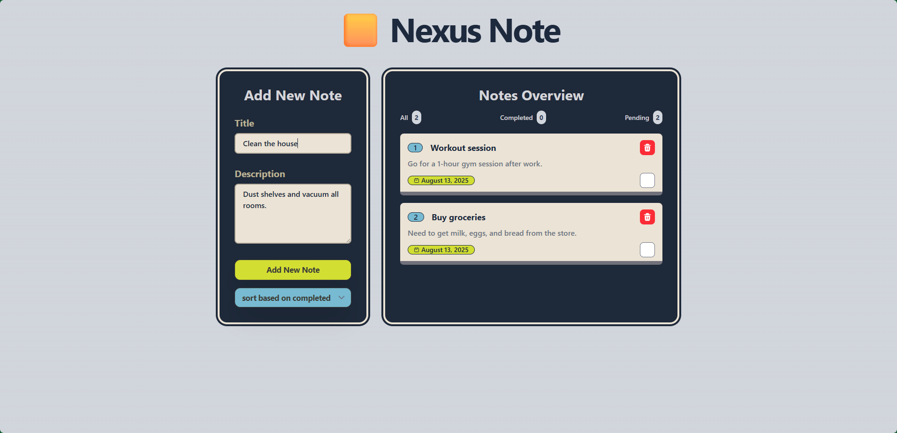

# Nexus Note 📝



A simple and elegant note-taking application built with React to practice fundamental React concepts. This project demonstrates state management, component composition, and modern React patterns.

## 🚀 Features

- **Add Notes**: Create new notes with a simple form
- **Complete Notes**: Mark notes as completed with a single click
- **Delete Notes**: Remove notes you no longer need
- **Sort Notes**: Organize notes by completion status
- **Responsive Design**: Works seamlessly on desktop and mobile devices
- **Modern UI**: Clean interface built with Tailwind CSS

## 🛠️ Tech Stack

- **React 19** - Latest React with modern hooks and patterns
- **Vite** - Fast build tool and development server
- **Tailwind CSS** - Utility-first CSS framework for styling
- **FontAwesome** - Icon library for enhanced UI
- **ESLint** - Code linting and quality assurance

## 📦 Installation

1. Clone the repository:

```bash
git clone <repository-url>
cd nexus-note
```

2. Install dependencies:

```bash
npm install
```

3. Start the development server:

```bash
npm run dev
```

4. Open your browser and navigate to `http://localhost:5173`

## 🎯 Available Scripts

- `npm run dev` - Start development server with hot reload
- `npm run build` - Build the project for production
- `npm run preview` - Preview the production build locally
- `npm run lint` - Run ESLint to check code quality

## 🏗️ Project Structure

```
src/
├── App.jsx                 # Main application component
├── main.jsx               # Application entry point
├── index.css              # Global styles
└── assets/
    └── components/        # Reusable React components
        ├── Header.jsx     # Application header
        ├── AddNoteForm.jsx # Form for adding new notes
        ├── NoteList.jsx   # Display and manage notes
        ├── NoteStatus.jsx # Note completion status
        ├── SortNote.jsx   # Note sorting functionality
        └── Message.jsx    # User feedback messages
```

## 🎓 Learning Objectives

This project is designed to practice and understand:

- **React Hooks**: `useState` for state management
- **Component Composition**: Breaking UI into reusable components
- **Props and Event Handling**: Passing data and functions between components
- **Conditional Rendering**: Showing/hiding elements based on state
- **List Rendering**: Mapping over arrays to display dynamic content
- **Form Handling**: Controlled components and form submission
- **Modern React Patterns**: Functional components and hooks

## 🎨 Key Components

- **App.jsx**: Main component managing the application state
- **AddNoteForm**: Handles note creation with form validation
- **NoteList**: Displays notes with completion and deletion options
- **SortNote**: Provides sorting functionality for better organization

## 📱 Responsive Design

The application is fully responsive and works great on:

- Desktop computers
- Tablets
- Mobile phones

## 🤝 Contributing

This is a learning project, but feel free to:

- Report bugs
- Suggest new features
- Submit pull requests

## 📄 License

This project is open source and available under the [MIT License](LICENSE).

---

**Happy Coding! 🚀**
